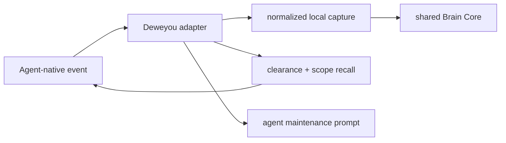

# Context Hub Agent Adapters



All adapters normalize agent-specific payloads into the same Event and Source
schema. Capture is local and fail-open. Context injection uses the local
clearance/scope filter and includes the current `device/<id>` scope.

| Agent | Installation surface | Capture events | Context surface |
|-------|----------------------|----------------|-----------------|
| Codex CLI/TUI | `~/.codex/hooks.json` plus `[features].hooks = true` in `~/.codex/config.toml` | `SessionStart`, `UserPromptSubmit`, `Stop` | Hook JSON `additionalContext` |
| Claude Code | `~/.claude/settings.json` | `SessionStart`, `UserPromptSubmit`, `Stop` | Hook JSON `hookSpecificOutput.additionalContext` |
| Trae | `<repo>/.trae/hooks.json` (preferred) or experimental user path | `SessionStart`, `UserPromptSubmit`, `Stop` | Hook JSON context result |
| Hermes Agent | `~/.hermes/config.yaml` plus `~/.hermes/agent-hooks/deweyou-brain.py` | `on_session_start`, `pre_llm_call`, `post_llm_call`, `on_session_end` | `pre_llm_call` returns `{"context": "..."}` |
| OpenClaw | linked plugin sourced from `~/.deweyou/brain/adapters/openclaw/` | `before_prompt_build`, `agent_end`, `session_start`, `session_end` | `before_prompt_build` returns `prependContext` |

## Common behavior

- Hooks call `deweyou-cli brain capture` or `brain hook run`.
- `transcript` and `transcript_path` are moved into local raw Source records;
  Git receives only their manifests.
- Secret-like payload or transcript content is quarantined before a Git path is
  written.
- A payload containing `cwd` becomes device-scoped evidence.
- `SessionStart`, `UserPromptSubmit`, Hermes `pre_llm_call`, and OpenClaw
  `before_prompt_build` retrieve context and replay unfinished maintenance.
- `Stop`, Hermes `post_llm_call`/`on_session_end`, and OpenClaw
  `agent_end`/`session_end` queue and expose semantic maintenance to the active
  agent model.
- Any capture, index, or recall error returns an empty hook result.

## Codex, Claude Code, and Trae

The installer edits only lifecycle arrays and identifies owned commands by the
`deweyou-cli brain hook run --agent ...` marker. It writes a
`.deweyou-brain.bak` backup before modifying an existing file. Uninstall
removes only marked commands and preserves other blocks, including unknown
future shapes.

For Codex, the installer also enables the current `[features].hooks = true`
flag while preserving other TOML sections. Codex CLI/TUI asks the user to
review newly installed hooks; that trust decision is intentionally not
bypassed. Desktop and IDE hook parity has changed across Codex releases, so
configuration presence is not runtime proof.

Trae's documented community surface is currently repository-local and can
depend on product edition. Prefer:

```bash
deweyou-cli brain hook install --agent trae --repo /path/to/project
```

Without `--repo`, Deweyou writes the compatibility path
`~/.trae/hooks.json`, but reports only configuration state. Restart the agent,
start a small test session, then inspect `brain status` and the knowledge
repository's current device event namespace. If the current Trae edition does
not load hooks, use historical import.

## Hermes Agent

Hermes documents shell hooks as non-blocking subprocesses using JSON stdin and
JSON stdout. `pre_llm_call` is the context injection seam; event-specific
fields such as `user_message` are under `extra`.

The generated Python adapter captures all four events and returns context only
for `pre_llm_call`. Hermes requires first-use consent for each `(event,
command)` pair.

Runtime checks:

```bash
hermes hooks list
hermes hooks doctor
hermes hooks test pre_llm_call
```

Hermes also has a pluggable `MemoryProvider` lifecycle (`prefetch`,
`sync_turn`, and `shutdown`). A future native Deweyou provider can replace the
shell adapter without changing the Brain Core schema.

References:

- [Hermes Event Hooks](https://hermes-agent.nousresearch.com/docs/user-guide/features/hooks/)
- [Hermes memory provider architecture](https://github.com/NousResearch/hermes-agent/blob/main/AGENTS.md)

## OpenClaw

OpenClaw requires a plugin package and manifest. The installer writes the
source package under the Deweyou runtime, then, when the CLI is available,
runs:

```bash
openclaw plugins install --link ~/.deweyou/brain/adapters/openclaw --force
openclaw plugins enable deweyou-brain
openclaw config set \
  plugins.entries.deweyou-brain.hooks.allowConversationAccess \
  true --strict-json
```

Restart the Gateway and inspect the loaded runtime:

```bash
openclaw plugins inspect deweyou-brain --runtime --json
```

The adapter uses `before_prompt_build` to return `prependContext`; observation
hooks capture agent and session endings asynchronously. Raw `agent_end`
capture requires the explicit `allowConversationAccess` setting above.
OpenClaw policy can disable prompt mutation through
`plugins.entries.deweyou-brain.hooks.allowPromptInjection=false`, so runtime
inspection and an actual prompt are the final proof.

References:

- [OpenClaw plugin management](https://docs.openclaw.ai/plugins)
- [OpenClaw plugin hooks](https://docs.openclaw.ai/plugins/hooks)
- [OpenClaw plugin manifest and discovery](https://docs.openclaw.ai/plugins/manifest)

## Native history discovery and import

Deweyou has first-class read-only discovery for Codex and Hermes:

```bash
deweyou-cli brain import --discover --dry-run
deweyou-cli brain import --discover
deweyou-cli brain import --discover --agent codex
deweyou-cli brain import --discover --agent hermes
```

Codex discovery scans the current `CODEX_HOME` (or `~/.codex`) session and
archive trees. Hermes discovery opens the current `HERMES_HOME` (or
`~/.hermes`) `state.db` and profile databases with SQLite read-only mode, and
also scans legacy session JSONL directories.

The native normalizers retain user messages and user-visible assistant message
content, not system/developer prompts, reasoning, tool output, or device
metadata. Imported history is private and device-scoped by default. Stable
session/source keys make reruns idempotent.

## Explicit export fallback

When a framework has no working Hook surface, export its sessions and use:

```bash
deweyou-cli brain import --agent <agent> --path <file-or-directory>
```

Historical import is also the recovery path after an adapter was disabled. It
preserves the supplied source content in the local raw-source store and lets
the same agent-driven maintenance pipeline govern it. This mode supports
Codex, Claude Code, Hermes, OpenClaw, and Trae, but unlike native discovery it
does not remove framework-specific metadata.

Implementation reference:
[adapter installation and normalization](../cli/src/cli/brain-hooks.ts#L1) and
[native history discovery](../cli/src/cli/brain-history.ts#L1).

---
*Last updated: 2026-07-27 | Reason: Context Hub V1 implementation*
