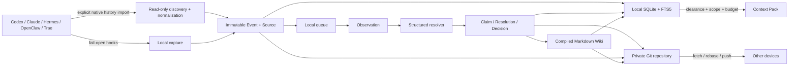

# Context Hub Architecture



The Deweyou Context Hub is a local-first personal knowledge runtime shared by
multiple devices and agent frameworks. This repository owns the runtime,
policies, adapters, and CLI. Personal knowledge lives in a separate Git
repository configured at `~/.deweyou/brain/config.yaml`.

## System boundary

The active agent path performs only local capture and optional local recall.
Remote Git operations, model compilation, and Wiki rebuilding run through
`brain worker`, normally launched by a macOS LaunchAgent. A failed hook returns
an empty response and does not block the agent task.

Historical import is a separate, user-triggered path. Native Codex and Hermes
stores are discovered read-only, normalized before capture, and assigned
`private` classification plus the current `device/<id>` scope by default. The
normalizer keeps user messages and user-visible assistant message content while
excluding system/developer prompts, reasoning, tool output, and device
metadata. Stable source/session identities make repeated imports idempotent.

## Three storage layers

### Canonical knowledge repository

The separate Git repository contains portable, durable records:

```text
AGENTS.md
brain.yaml
schemas/
policy/
devices/
events/<device-id>/
sources/sessions/<agent>/
observations/
claims/
resolutions/
decisions/
wiki/
```

Sources and events are evidence. Claims, resolutions, and decisions are the
governed ledger. The Wiki is a deterministic view and can be regenerated.

### Local runtime

Derived and operational state stays under `~/.deweyou/brain/`:

```text
config.yaml
brain.sqlite
brain.sqlite-wal
brain.sqlite-shm
queue/
quarantine/
locks/
context-packs/
adapters/
schedule.json
```

This directory is the single cleanup boundary. SQLite, FTS, queues, locks,
quarantine, adapter source, and caches are never synchronized through Git.

### Consumer projection

`brain export` creates a replaceable, classification-filtered projection for a
bot, static Wiki, or other consumer. It never publishes the canonical private
repository directly.

## Artifact model

The knowledge pipeline is:

```text
Source -> Event -> Observation -> Resolution -> Claim -> Wiki
                                      |
                                      +-> Human Decision
```

- **Source**: normalized session or imported material.
- **Event**: immutable agent lifecycle fact in a device namespace.
- **Observation**: provisional candidate knowledge.
- **Claim**: atomic, sourced, scoped knowledge.
- **Resolution**: validated structured operations over observations and claims.
- **Decision**: a human exception, including lifecycle changes.
- **Wiki**: readable pages compiled from effective claims.
- **Context Pack**: an ephemeral, token-budgeted retrieval result.

## Classification and scope

Every durable artifact carries both:

```yaml
classification: confidential
scope:
  - personal
  - domain/finance
```

The classification order is:

```text
public < private < confidential < restricted
```

Access requires sufficient clearance and an allowed scope. Filtering happens
in SQLite before content is assembled or passed to a model. Derived artifacts
inherit the highest input classification, and a model cannot lower it.

Classification controls routing and display; it is not encryption. V1 supports
plaintext private Git repositories. `sensitive-only` and `all` encryption
values are reserved and rejected until implemented.

An Event or Source containing a local `cwd` is assigned only to
`device/<device-id>`. Its requested personal/project scopes are retained as
governance hints. A resolver may create a separate semantic Claim for
cross-device use, but another device never receives the original absolute path
through normal recall.

## Knowledge lifecycle

Artifacts are never routinely destroyed:

- `active`: normal recall and compilation.
- `stale`: down-ranked and labeled.
- `superseded`: retained for provenance, excluded from normal recall.
- `archived`: returned only in explicit historical recall.
- `deleted`: soft-deleted and excluded while its tombstone remains.

`brain state` writes an immutable user Decision instead of mutating a Claim.
Hard purge is reserved for credential or privacy incidents.

Age alone does not mark knowledge stale; enduring preferences and principles
may be old and still correct. Age only lowers the retrieval freshness score.
`stale` requires a user Decision or a governed `MARK_STALE` operation backed by
an expired validity window, changed source/project version, or newer evidence.

## Structured governance

Models may propose only:

```text
ADD_CLAIM
MERGE_CLAIMS
SUPERSEDE_CLAIM
SPLIT_SCOPE
MARK_STALE
LINK_ENTITIES
REJECT_OBSERVATION
REQUEST_HUMAN_DECISION
```

A proposal includes a deterministic job id, inputs, evidence, confidence,
provider/model and prompt versions, policy version, and device id. Validation
rejects malformed operations and classification downgrades before any canonical
resolution is written.

The default compiler provider is `none`: maintenance creates provisional
Observations but does not invent Claims. Set `compiler.provider: command` and
provide a JSON stdin/stdout command to attach a model resolver.

## Git convergence

Each device writes immutable event paths under its own namespace. Sync:

1. stages only durable repository paths;
2. scans staged text for secret-like content;
3. commits local durable changes;
4. checks and fetches the remote branch;
5. rebases local commits;
6. auto-recovers conflicts under generated `wiki/` paths;
7. resolves concurrent `resolutions/jobs/<job-id>.json` by the stable,
   lexicographically smallest proposal path while preserving every proposal;
8. marks Claims emitted only by losing proposals ineffective in the local
   materialized view;
9. aborts on source, event, claim identity, or decision conflicts;
10. recompiles the Wiki and retries bounded push races;
11. incrementally refreshes the local index.

No long-lived compiler leader or distributed lock is required. Concurrent
devices converge through immutable ids, deterministic jobs, Git history, and
bounded retry.

Runtime-created commits and rebase continuations use the stable local identity
`Deweyou Brain <brain@localhost>`, so a newly provisioned device does not need a
personal global Git identity before it can synchronize.

## Current V1 constraints

- Node.js 22.5 or newer is required for built-in `node:sqlite`.
- FTS5 is the only search backend; vectors and a graph database are deferred.
- Scheduled workers use macOS LaunchAgents.
- Only plaintext Git sync is implemented.
- The resolver is an external command contract, not a bundled model service.
- Hook configuration status is not proof that an agent runtime reloaded it;
  use the adapter-specific runtime checks in the operations guide.

Implementation references:
[Brain runtime](../cli/src/cli/brain.ts#L1),
[native history discovery](../cli/src/cli/brain-history.ts#L1),
[local index](../cli/src/cli/brain-index.ts#L1),
[governance](../cli/src/cli/brain-governance.ts#L1), and
[Git convergence](../cli/src/cli/brain-git.ts#L1).

---
*Last updated: 2026-07-27 | Reason: Context Hub V1 implementation*
