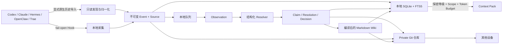

# Context Hub 架构



Deweyou Context Hub 是一套本地优先、跨设备、跨 Agent 的个人知识运行时。
当前仓库维护 CLI、知识治理策略、Git 同步、本地索引和适配器；个人知识内容放在
另一个 Git 仓库中，其本地路径记录在 `~/.deweyou/brain/config.yaml`。

## 总体链路

Hook 主链只做本地采集和可选的本地 Recall，不等待 Git 或模型。后台
`brain worker` 负责知识治理、Wiki 编译和同步；任一步失败都不会阻塞当前 Agent。

历史导入是独立且必须由用户显式触发的链路。Codex/Hermes 原生数据源只读打开，
归一化后再进入 Capture，默认标记为 `private` 和当前 `device/<id>` Scope。归一化
只保留用户消息与用户可见的 Agent 消息，排除 system/developer prompt、
reasoning、工具输出和设备元数据。稳定的 Source/Session ID 保证重复导入幂等。

## 三层存储

个人知识仓库保存可同步的耐久数据：Source、Event、Observation、Claim、
Resolution、Decision、Wiki、Schema 与 Policy。

`~/.deweyou/brain/` 保存单机派生状态：配置、SQLite、FTS、队列、隔离区、
锁、Context Pack 缓存、适配器源码和定时任务信息。这也是统一清理边界。

`brain export` 生成按保密等级和 Scope 过滤后的消费投影，用于 Bot 或静态
Wiki；不会直接发布完整的私人仓库。

## 保密等级与 Scope

每个耐久对象同时拥有：

```yaml
classification: confidential
scope:
  - personal
  - domain/finance
```

保密等级顺序为：

```text
public < private < confidential < restricted
```

消费者必须同时满足 clearance 和 allowed scopes。过滤发生在检索和模型调用
之前。派生对象继承所有输入中的最高保密等级，模型只能升级、不能降级。

分类是展示与路由策略，不等于加密。V1 支持 private Git 仓库中的明文数据；
加密模式只预留配置，没有实现。

包含本机 `cwd` 的原始 Event/Source 只属于 `device/<id>`。原本希望沉淀到
personal/project 的 Scope 会作为治理提示保留，由 Resolver 另建不含本地路径的
跨设备 Claim。

## 生命周期

- `active`：正常召回和编译。
- `stale`：降低权重并明确标注。
- `superseded`：保留证据链，默认不召回。
- `archived`：只有显式历史检索才返回。
- `deleted`：软删除；保留 tombstone，但不召回、不编译。

`brain state` 会新增不可变的用户 Decision，不直接改写 Claim。只有误收凭证或
隐私事故才走紧急硬删除。

“旧”不等于“过时”：年龄只降低检索新鲜度，不会自动改变状态。只有人工 Decision
或有新证据支撑的 `MARK_STALE`（例如有效期已到、来源/项目版本变化、出现更新结论）
才会把 Claim 标为 `stale`。

## Git 收敛

每台设备只写自己的不可变 Event 命名空间。同步会先提交本地耐久变更，再
fetch/rebase。生成的 `wiki/` 冲突会自动重建；Source、Event、Claim、
或 Decision 冲突会中止 rebase 并保留现场。同一个确定性 Job 被多台离线设备
同时处理时，会保留所有 Proposal，并按 Proposal 路径字典序稳定选择 Canonical
Resolution；未选 Proposal 独有的 Claim 会保留证据，但在本地索引和 Wiki 中失效。
Push 竞态会做有界重试。

SQLite、FTS、队列、锁和缓存永远不会进入 Git。

Runtime 创建的提交与 rebase continuation 使用稳定的本地身份
`Deweyou Brain <brain@localhost>`，因此新设备不需要预先配置个人全局 Git identity
也能完成同步。

## V1 边界

- Node.js 需要 22.5 或以上。
- 当前使用 SQLite FTS5，不使用 Vector DB 或 Graph DB。
- 定时 Worker 当前使用 macOS LaunchAgent。
- Git 远端加密尚未实现。
- Resolver 通过外部 JSON stdin/stdout 命令接入。
- `brain hook status` 只能证明配置/安装状态；仍需按运维文档验证 Agent
  Runtime 已重新加载。

实现入口：
[Brain Runtime](../cli/src/cli/brain.ts#L1)、
[原生历史发现](../cli/src/cli/brain-history.ts#L1)、
[本地索引](../cli/src/cli/brain-index.ts#L1)、
[知识治理](../cli/src/cli/brain-governance.ts#L1) 与
[Git 收敛](../cli/src/cli/brain-git.ts#L1)。

---
*最后更新：2026-07-27｜原因：Context Hub V1 实现*
