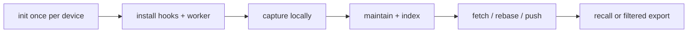

# Context Hub Operations



## Prerequisites

- Node.js 22.5 or newer
- Git
- a private, preferably empty, remote repository for personal knowledge
- `deweyou-cli` installed globally

The remote may contain plaintext in V1. Do not store credentials even in a
private repository.

## Initialize the first device

For a guided setup, run:

```bash
deweyou-cli brain init
```

The wizard collects the local knowledge repository, device id, optional private
Git remote, and branch. It can also import discovered Codex/Hermes history,
install global Codex/Claude/Hermes/OpenClaw adapters, and install the macOS
worker. History import, hooks, and scheduling are all opt-in and unselected by
default. Trae remains a separate repository-local install because it requires
an explicit project path.

For scripts or unattended setup, pass the repository explicitly:

```bash
deweyou-cli brain init \
  --repo "$HOME/Documents/personal-brain" \
  --device macbook-main \
  --remote git@github.com:YOUR_NAME/personal-brain.git
```

If the remote `main` branch already exists, `brain init` clones it before
adding missing templates. If the remote is empty, it initializes a new local
repository and binds `origin`.

Inspect the result:

```bash
deweyou-cli brain status
cat "$HOME/.deweyou/brain/config.yaml"
```

The config contains the local knowledge path, device id, sync behavior,
default classification/scopes/clearance, token budget, and compiler provider.
Use a unique, stable, lowercase `--device` value on each computer.

## Initialize another device

Run the same command with a different local path or device id:

```bash
deweyou-cli brain init \
  --repo "$HOME/Documents/personal-brain" \
  --device macbook-travel \
  --remote git@github.com:YOUR_NAME/personal-brain.git
```

Then rebuild the local index:

```bash
deweyou-cli brain index
```

## Install agent adapters

Plan and install:

```bash
deweyou-cli brain hook install --agent all --dry-run
deweyou-cli brain hook install --agent all
deweyou-cli brain hook status --agent all
```

For Trae, install the repository-local adapter in each project that should
participate:

```bash
deweyou-cli brain hook install --agent trae --repo /path/to/project
```

Uninstall only Deweyou-owned entries:

```bash
deweyou-cli brain hook uninstall --agent all --dry-run
deweyou-cli brain hook uninstall --agent all
```

The installer backs up modified JSON/YAML configuration and preserves unrelated
hooks. OpenClaw source is kept under
`~/.deweyou/brain/adapters/openclaw/`. When the `openclaw` CLI is present, the
installer runs a linked plugin install and enables `deweyou-brain`. Restart the
Gateway, then verify. The installer also explicitly enables
`allowConversationAccess` so `agent_end` can be captured; remove that setting
if only session boundaries and prompt injection are desired.

```bash
openclaw plugins inspect deweyou-brain --runtime --json
```

Hermes shell hooks use its first-use consent model. Approve the four Deweyou
hook/event pairs and validate them with:

```bash
hermes hooks doctor
hermes hooks test pre_llm_call
```

See [Context Hub adapters](./context-hub-adapters.md) for exact files, events,
and limitations.

Codex CLI/TUI similarly requires reviewing newly installed hooks. The installer
enables `[features].hooks = true` but never bypasses Codex hook trust.

## Install the background worker

On macOS:

```bash
deweyou-cli brain schedule install --interval 300 --dry-run
deweyou-cli brain schedule install --interval 300
deweyou-cli brain schedule status
```

The LaunchAgent runs `brain worker`, which uses a local overlap lock, maintains
the queue, compiles the Wiki, and synchronizes Git. Remove it with:

```bash
deweyou-cli brain schedule uninstall --dry-run
deweyou-cli brain schedule uninstall
```

Run the same work manually at any time:

```bash
deweyou-cli brain worker
deweyou-cli brain worker --no-push
```

## Import existing sessions

First preview the native stores that Deweyou can discover:

```bash
deweyou-cli brain import --discover --dry-run
```

Import both discovered Codex and Hermes history stores:

```bash
deweyou-cli brain import --discover
```

Limit discovery and import to one framework when needed:

```bash
deweyou-cli brain import --discover --agent codex
deweyou-cli brain import --discover --agent hermes
```

Codex discovery reads `~/.codex/sessions/` and
`~/.codex/archived_sessions/`, or the equivalent paths under `CODEX_HOME`.
Hermes discovery opens `~/.hermes/state.db` and profile databases read-only,
and also recognizes legacy `sessions/*.jsonl` exports. An unreadable or
incompatible native store is reported as a warning without blocking discovery
of the other stores.

Native import normalizes user messages and user-visible assistant message
content; Codex imports only `final_answer` messages when that phase is present.
It does not copy system/developer prompts, reasoning, tool output, or Codex
workspace metadata. Discovered history defaults to `private` classification
and `device/<device-id>` scope. IDs are deterministic, so rerunning the same
command reports already-present records instead of duplicating them.

For another framework or an explicit export, import one supported file or a
directory tree:

```bash
deweyou-cli brain import \
  --agent hermes \
  --path "$HOME/exports/hermes" \
  --scope personal \
  --classification private
```

Supported files are JSON, JSONL, Markdown, text, and YAML. Files are imported
deterministically in bounded chunks. Unsupported, empty, and files over 100 MiB
are skipped. Secret-like chunks go to local quarantine instead of Git. This
explicit-path mode preserves the supplied source content and should therefore
be used only for exports you intend to retain.

Import writes immutable Sources/Events and queues maintenance. If the
background worker is not installed, materialize Observations and refresh the
local index, then synchronize:

```bash
deweyou-cli brain worker --no-push
deweyou-cli brain sync
```

With the default `compiler.provider: none`, the imported material remains a
provisional Observation until a configured resolver or user decision promotes
it to governed Claims.

## Capture, maintain, recall, and sync

Normally adapters call capture. Manual examples are useful for debugging:

```bash
deweyou-cli brain capture \
  --agent codex \
  --event session-end \
  --scope personal,repo/agents \
  --classification private \
  --data '{"summary":"Use append-only device events."}'

deweyou-cli brain maintain
deweyou-cli brain index
deweyou-cli brain recall \
  --query "append-only events" \
  --scope personal,repo/agents \
  --clearance private \
  --budget 1200
deweyou-cli brain sync
```

With `compiler.provider: none`, `maintain` creates provisional Observations and
leaves jobs pending. Configure `compiler.provider: command` to emit governed
Claims. The command receives one JSON request on stdin and must return one JSON
object containing `model`, `prompt_version`, `confidence`, and `operations`.

## Soft deletion, archive, and restore

```bash
deweyou-cli brain state \
  --id claim-example \
  --status stale \
  --reason "The source is older than the current project decision."

deweyou-cli brain state \
  --id claim-example \
  --status archived \
  --reason "Keep for history but omit from normal recall."

deweyou-cli brain state \
  --id claim-example \
  --status deleted \
  --reason "Explicitly forgotten."

deweyou-cli brain state \
  --id claim-example \
  --status active \
  --reason "Restored after review."
```

Each command creates a Decision. The original artifact remains in Git history.

## Publish a safe projection

Create a public Wiki projection:

```bash
deweyou-cli brain export \
  --output "$HOME/Sites/public-brain" \
  --clearance public \
  --scope domain/reading \
  --format wiki \
  --dry-run

deweyou-cli brain export \
  --output "$HOME/Sites/public-brain" \
  --clearance public \
  --scope domain/reading \
  --format wiki
```

`knowledge` format also includes allowed Claims and Decisions. Export replaces
only a directory containing the Deweyou export marker, so it will not erase an
unmanaged directory. Every export re-filters from the local index; copying the
canonical repository into a web root is unsafe.

## Failure recovery

### Secret quarantine

Inspect local-only findings:

```bash
find "$HOME/.deweyou/brain/quarantine" -type f -maxdepth 1
```

Rotate the credential first. Remove the bad canonical file if one was manually
added, rewrite Git history only when necessary, then rebuild:

```bash
deweyou-cli brain index
deweyou-cli brain sync
```

### Canonical Git conflict

`brain sync` aborts rebase automatically and reports the conflicting paths.
Review both versions, append a Resolution or Decision instead of silently
choosing one, commit it, and rerun sync. Generated Wiki conflicts need no
manual editing. A conflict for the same deterministic
`resolutions/jobs/<job-id>.json` is also automatic: both device proposals
remain, the lexicographically smallest proposal path wins, and Claims emitted
only by the losing proposal become ineffective.

### Rebuild local state

SQLite is disposable:

```bash
rm "$HOME/.deweyou/brain/brain.sqlite" \
   "$HOME/.deweyou/brain/brain.sqlite-shm" \
   "$HOME/.deweyou/brain/brain.sqlite-wal" 2>/dev/null || true
deweyou-cli brain index
```

### Disable integrations

```bash
deweyou-cli brain schedule uninstall
deweyou-cli brain hook uninstall --agent all
```

The knowledge repository is not deleted by either command.

Implementation references:
[CLI routing](../cli/src/cli/brain-cli.ts#L1),
[native history discovery](../cli/src/cli/brain-history.ts#L1),
[worker lifecycle](../cli/src/cli/brain-lifecycle.ts#L1), and
[scheduler](../cli/src/cli/brain-schedule.ts#L1).

---
*Last updated: 2026-07-27 | Reason: Context Hub V1 implementation*
