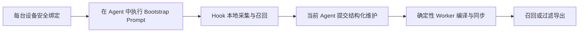

# Context Hub 运维手册



## 前置条件

- Node.js 22.5 或以上
- Git
- 一个 private 个人知识远端仓库；仓库可以已有内容
- 全局安装 `deweyou-cli`

V1 可以在 private Git 仓库中存明文，但任何等级都禁止凭证、Cookie、Token 和
私钥。

## 初始化第一台设备

交互式初始化：

```bash
deweyou-cli brain init
```

向导只收集个人知识仓库的本地路径、设备 ID、可选的 private Git 远端和分支。
它不会发现或导入 Session，不会安装 Hook 或 Worker，也不会 commit/push。

脚本或无人值守环境需要显式传入仓库：

```bash
deweyou-cli brain init \
  --repo "$HOME/Documents/personal-brain" \
  --device macbook-main \
  --remote git@github.com:YOUR_NAME/personal-brain.git
```

如果远端分支已存在，空路径会先 clone；已有且匹配的干净 Checkout 会先做安全
fast-forward，再仅补齐缺失模板。任何已有文件都不会被重置或覆盖。Dirty
Worktree、分支或 Origin 不匹配、历史分叉都会直接拒绝；远端已有历史时，也拒绝
非 Git 的非空目录。空远端会保留现有本地文件，必要时初始化 Git 并绑定
`origin`。

初始化后，在当前 Agent 中执行它对应的 Bootstrap Prompt：

```bash
deweyou-cli brain bootstrap --agent codex
```

Prompt 会要求当前模型检查现有知识、只安装自己的 Hook、提取当前会话中值得长期
保留的简要知识、通过 `brain apply` 提交结构化操作、验证 Recall 并同步。它不会
批量搬运历史 Session。

```bash
deweyou-cli brain status
cat "$HOME/.deweyou/brain/config.yaml"
```

三台设备分别使用稳定且唯一的小写 `device id`。每台设备都可离线采集和检索，
恢复网络后由 Git 收敛。

## 安装 Agent Hook

```bash
deweyou-cli brain hook install --agent all --dry-run
deweyou-cli brain hook install --agent all
deweyou-cli brain hook status --agent all
```

Trae 当前优先使用项目级 Hook，需要在每个参与的代码仓库安装：

```bash
deweyou-cli brain hook install --agent trae --repo /path/to/project
```

删除时只会移除 Deweyou 自己的条目：

```bash
deweyou-cli brain hook uninstall --agent all --dry-run
deweyou-cli brain hook uninstall --agent all
```

OpenClaw 插件源码位于 `~/.deweyou/brain/adapters/openclaw/`。本机存在
`openclaw` CLI 时，安装器会执行 linked install 并启用插件；随后需要重启
Gateway 并验证。安装器也会显式启用 `allowConversationAccess`，用于采集
`agent_end`；如果只需要会话边界和上下文注入，可以关闭该项。

```bash
openclaw plugins inspect deweyou-brain --runtime --json
```

Hermes 第一次运行每个 shell hook 时会要求授权。授权后执行：

```bash
hermes hooks doctor
hermes hooks test pre_llm_call
```

Codex CLI/TUI 也会要求人工审核新 Hook。安装器会开启
`[features].hooks = true`，但不会绕过 Codex 的 Hook Trust。

## 安装后台 Worker

macOS 上：

```bash
deweyou-cli brain schedule install --interval 300 --dry-run
deweyou-cli brain schedule install --interval 300
deweyou-cli brain schedule status
```

LaunchAgent 周期执行 `brain worker`。Worker 使用本地锁避免重入，只编译 Wiki、
刷新索引并 fetch/rebase/push；它不会调用模型或处理 Observation 的语义晋升。
手动运行：

```bash
deweyou-cli brain worker
deweyou-cli brain worker --no-push
```

卸载：

```bash
deweyou-cli brain schedule uninstall
```

## 导入历史会话

先只读预览本机可发现的数据源：

```bash
deweyou-cli brain import --discover --dry-run
```

确认后导入 Codex 和 Hermes 历史：

```bash
deweyou-cli brain import --discover
```

也可以只导入一个 Agent：

```bash
deweyou-cli brain import --discover --agent codex
deweyou-cli brain import --discover --agent hermes
```

Codex 会扫描 `~/.codex/sessions/`、`~/.codex/archived_sessions/`，或
`CODEX_HOME` 下的对应目录。Hermes 会以只读方式打开
`~/.hermes/state.db` 与 profile 数据库，也兼容旧版 `sessions/*.jsonl`。某个原生
数据源无法读取或 Schema 不兼容时会输出 warning，但不会阻断其他数据源的发现。

原生导入必须显式执行，绝不是 `brain init` 的一部分。它保留用户消息与用户可见
的 Agent 消息；Codex 在存在 phase 标记时只导入
`final_answer`。它不会复制 system/developer prompt、reasoning、工具输出或
Codex 工作区元数据。默认使用 `private` 保密等级与 `device/<device-id>` Scope。
ID 是确定性的，重复执行只会报告已存在记录，不会重复写入。

其他 Agent 或手工导出的文件使用显式路径模式：

```bash
deweyou-cli brain import \
  --agent hermes \
  --path "$HOME/exports/hermes" \
  --scope personal \
  --classification private
```

支持 JSON、JSONL、Markdown、文本和 YAML。文件会按确定性 ID 分块导入；空文件、
不支持的格式和超过 100 MiB 的文件会跳过；疑似 Secret 进入本地隔离区。显式路径
模式会把所提供的源内容保存在当前设备的
`~/.deweyou/brain/raw-sources/`，因此只应导入你确实需要的导出文件。

Git 只接收 Source Manifest 与不可变 Event。导入后，在当前 Agent 中生成
Observation、检查本地 Source 并提交结构化操作，再同步：

```bash
deweyou-cli brain maintain --agent codex
# 按输出 Prompt 操作，并对每个 Job 执行 brain apply。
deweyou-cli brain sync
```

在匹配的 `brain apply` 成功前，导入内容只会停留在临时 Observation。

## 日常命令

```bash
deweyou-cli brain status
deweyou-cli brain maintain --agent codex
deweyou-cli brain apply --data '<proposal-json>'
deweyou-cli brain index
deweyou-cli brain recall \
  --query "LLM Wiki" \
  --scope personal,repo/agents \
  --clearance private \
  --budget 1200
deweyou-cli brain sync
```

`maintain` 只生成临时 Observation，并为当前 Agent 模型打印维护 Prompt。
`brain apply` 是模型提交结果的唯一入口，会校验 pending Job、设备、策略、保密
等级、输入和证据引用。后台进程不会执行语义治理。

## 过期、归档、删除与恢复

```bash
deweyou-cli brain state \
  --id claim-example \
  --status stale \
  --reason "已有更新的项目决定"

deweyou-cli brain state \
  --id claim-example \
  --status archived \
  --reason "只保留历史"

deweyou-cli brain state \
  --id claim-example \
  --status deleted \
  --reason "明确遗忘"

deweyou-cli brain state \
  --id claim-example \
  --status active \
  --reason "人工复核后恢复"
```

这些操作新增不可变 Decision，不直接改写或删除原 Claim。

## 生成可公开的 Wiki / Bot 数据

```bash
deweyou-cli brain export \
  --output "$HOME/Sites/public-brain" \
  --clearance public \
  --scope domain/reading \
  --format wiki \
  --dry-run

deweyou-cli brain export \
  --output "$HOME/Sites/public-brain" \
  --clearance public \
  --scope domain/reading \
  --format wiki
```

`knowledge` 格式还会带上允许显示的 Claim 和 Decision。导出目录包含专用 Marker；
命令拒绝覆盖普通目录。不要把完整私人知识仓库直接作为网站根目录。

## 故障恢复

Secret 隔离区只在本地：

```bash
find "$HOME/.deweyou/brain/quarantine" -type f -maxdepth 1
```

先轮换泄漏凭证，再清理错误来源。SQLite 可随时重建：

```bash
rm "$HOME/.deweyou/brain/brain.sqlite" \
   "$HOME/.deweyou/brain/brain.sqlite-shm" \
   "$HOME/.deweyou/brain/brain.sqlite-wal" 2>/dev/null || true
deweyou-cli brain index
```

如果 Git 出现 Canonical 冲突，`brain sync` 会自动 abort rebase 并保留本地工作。
人工比较两边证据，以 Resolution/Decision 追加结论，再重新同步。生成的 Wiki
冲突会自动重建，不需要手改。同一个确定性 Job 的
`resolutions/jobs/<job-id>.json` 冲突也会自动收敛：双方 Proposal 都保留，
Proposal 路径字典序最小者成为 Canonical Resolution，未选 Proposal 独有的 Claim
只保留证据，不进入有效索引或 Wiki。

停用所有自动入口：

```bash
deweyou-cli brain schedule uninstall
deweyou-cli brain hook uninstall --agent all
```

这两条命令都不会删除个人知识仓库。

实现入口：
[CLI 路由](../cli/src/cli/brain-cli.ts#L1)、
[原生历史发现](../cli/src/cli/brain-history.ts#L1)、
[Worker 生命周期](../cli/src/cli/brain-lifecycle.ts#L1) 与
[定时任务](../cli/src/cli/brain-schedule.ts#L1)。

---
*最后更新：2026-07-27｜原因：Context Hub V1 实现*
