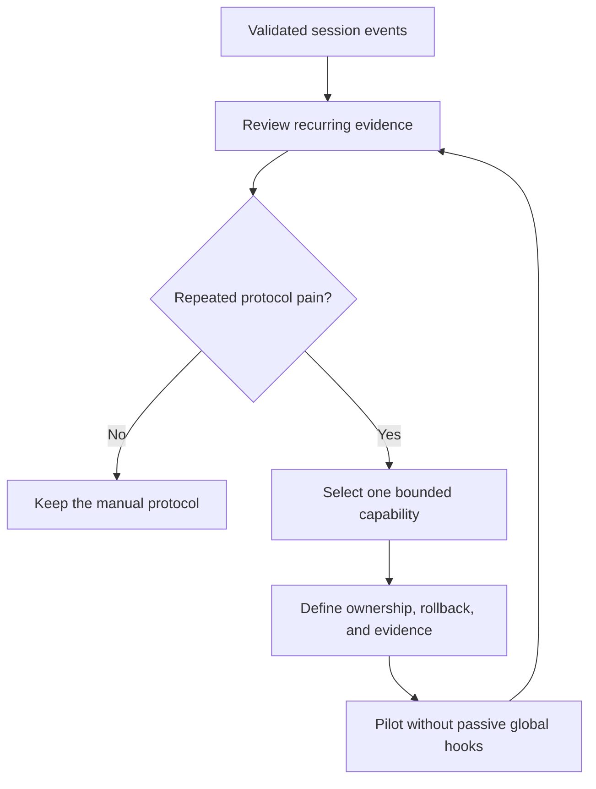

# When Should DDev Become More Automated?

DDev should become more automated only when repeated branch-session evidence
shows that the current protocol cannot reliably preserve intent, proof, or the
smallest recovery boundary. This is the durable backlog for capabilities that
are useful to study but intentionally not implemented yet.

## Current Baseline

- [`cli/src/cli/dev-events.ts#L1`](../cli/src/cli/dev-events.ts#L1) validates
  requirement, node, evidence, failure, review, recovery, and delivery events.
- [`cli/src/cli/dev.ts#L1`](../cli/src/cli/dev.ts#L1) appends events and generates
  the branch-session summary.
- [`skills/ddev/SKILL.md#L123`](../skills/ddev/SKILL.md#L123) keeps human-readable
  task, graph, evidence, and decision files as the primary recovery surface.
- `restart_from` is a recorded recommendation. No code automatically schedules,
  retries, approves, or delivers work.

## Deferred Capabilities And Adoption Triggers

| Capability | Implement Only When | Preserve |
| --- | --- | --- |
| Dynamic DAG scheduler | At least three real sessions show repeated manual ordering or accidental whole-flow reruns | Human-readable graph, explicit user gates, manual override |
| Executable Review Node | Review outcomes repeatedly lack a stable owner or cannot block delivery reliably | Review evidence, user confirmation, independent implementation review |
| Automatic recovery engine | Recorded `restart_from` hints are repeatedly correct and manual resume is the dominant cost | No automatic retry for permissions, destructive actions, security, or product decisions |
| Subagent binding | Parallel work repeatedly needs stable node ownership and mergeable outputs | One lifecycle owner, scoped inputs, explicit integration review |
| Cross-session analyzer | Enough comparable sessions exist to distinguish recurring patterns from one-off failures | Raw evidence, provenance, user review before changing rules or skills |
| Passive guardrail hooks | An explicit check is frequent, deterministic, safe across repositories, and repository opt-in cannot solve the problem | Coexistence with other harnesses, precise ownership, reversible install |
| Automatic knowledge or skill mutation | Recommendations reproduce across sessions and false positives have a safe review path | Proposed changes only; human review before repository or global mutation |

## Evaluation Rule

Before starting a deferred capability:

1. Cite the session events and summaries that demonstrate repeated pain.
2. Define the smallest project-owned boundary and deletion path.
3. Specify which decisions remain user-owned.
4. Add a rollback path and prove coexistence with other harness agents.
5. Pilot one capability without coupling the rest of the backlog.

Do not implement a capability merely because it appears in a reference Harness
architecture. DDev remains a personal cross-repository workflow, not a general
team orchestration platform.

---
*Last updated: 2026-07-21 | Reason: Recorded evidence-based adoption triggers for DDev capabilities deferred after the structured session protocol.*
