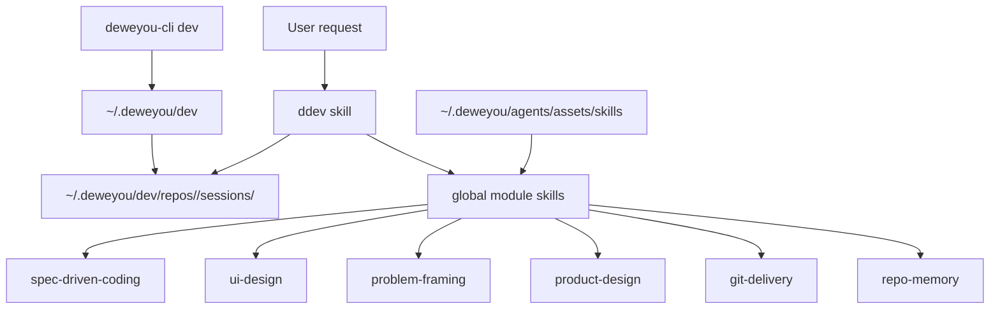

# DDev Framework Technical Plan

*Status: MVP implementation plan*

DDev is Dewey's personal cross-repository development harness. It is not a
general team agent platform. It gives one agent session a small local runtime,
a clear workflow owner, and enough written state to resume, verify, ship, and
learn without replaying the whole chat.

```text
DDev = Problem Framing + Harness + Demo + Loop + Evidence + Memory

Agent entry:      ddev / $DDev, or explicit project AGENTS.md opt-in
CLI namespace:    deweyou-cli dev ...
Global runtime:   ~/.deweyou/dev/
Module skills:    ~/.deweyou/agents/assets/skills/<skill>/SKILL.md
Per-repo state:   ~/.deweyou/dev/repos/<repo-id>/
```

## Goals

- Provide one default personal development workflow across repositories.
- Keep task context current, thin, and inspectable.
- Make branch-scoped work resumable without committing runtime state.
- Make verification evidence explicit before completion or delivery claims.
- Make brainstorming concrete by comparing options, stress-testing tradeoffs,
  and turning selected ideas into local HTML demos when useful.
- Let product, UI, coding, delivery, and memory skills live in the global Dewey
  asset cache and act as modules under one lifecycle owner.
- Keep DDev manually activated so it can coexist with other harness agents on
  the same machine.
- Keep DDev ownership limited to global `~/.deweyou/dev/` state and DDev-owned
  hook cleanup.

## Non-goals

- Do not build a general DAG/node runtime in the MVP.
- Do not create machine `state.json`, schedulers, review nodes, or subagent
  bindings yet.
- Do not require repositories to commit DDev runtime state.
- Do not replace project tests, CI, lint, browser checks, or review.
- Do not couple `product-notes` or `skill-eval` into the default development
  lifecycle.
- Do not install passive global hooks by default.
- Do not depend on Superpowers as the default backend. Superpowers ideas can be
  mirrored in DDev, and Superpowers can remain an optional compatibility path.

## Architecture



### Control Plane: `deweyou-cli dev`

The CLI owns deterministic local infrastructure:

- `install`: create manual runtime files and global per-repository session
  files.
- `status`: show runtime, repo state, and current branch session.
- `doctor`: diagnose runtime, global module skill cache, session files, legacy
  repo-local state, legacy git excludes, and absence of old DDev passive hooks.
- `clean`: remove DDev-owned state.
- `demo`: create the branch-session `demo/index.html` file and optionally serve
  it over a local static HTTP server.
- `uninstall`: remove the current repository's global state, legacy repo-local
  state and exact legacy git exclude lines, old DDev passive hooks from earlier
  versions, and the runtime only when no other repository state remains.

The CLI does not decide product behavior, implementation strategy, completion,
commit, push, or PR creation.

### Runtime Plane: Manual Activation

The MVP runtime is manual. `deweyou-cli dev install` prepares local state and
removes old DDev passive hooks, but it does not add `SessionStart`,
`UserPromptSubmit`, `Stop`, or any other global Codex hook.

This keeps DDev safe to install on machines that already run other harness
agents. A repository can still opt into DDev as its default workflow through
`AGENTS.md`; that is a project instruction, not a device-level passive hook.

### Workflow Plane: `ddev`

`ddev` owns the task lifecycle:

```text
Orient
  -> Problem framing, when exploration or Grilling is needed
  -> UI prototype gate, when requirement design touches UI
  -> Capture task/context/graph/verification
  -> Harness map
  -> HTML demo, when visibility helps
  -> Execute bounded loop
  -> Evidence
  -> Delivery, when requested
  -> Retrospect and cleanup
```

Other skills are global modules under `~/.deweyou/agents/assets/skills/`. They
return control to `ddev` after their domain work:

| Situation | Module |
| --- | --- |
| Grilling, brainstorming, critique, recommendation | `problem-framing/SKILL.md` |
| Product scope and tradeoffs | `product-design/SKILL.md` |
| UI requirement prototypes, interaction, visual evidence | `ui-design/SKILL.md` |
| Coding, debugging, TDD, verification | `spec-driven-coding/SKILL.md` |
| Commit, push, PR, CI | `git-delivery/SKILL.md` |
| Durable repo knowledge | `repo-memory/SKILL.md` |

`product-notes` and `skill-eval` stay independent and explicit.

## Local State Contract

```text
~/.deweyou/dev/
  config.json
  repos/
    <repo-id>/
      config.json
      sessions/
        <branch>/
          task.md
          brainstorm.md
          context.md
          graph.md
          decisions.md
          verification.md
          evidence.md
          demo.md
          demo/
            index.html
          retrospective.md
          events.jsonl
          stop-issues.txt
```

File roles:

- `task.md`: goal, scope, non-goals, acceptance criteria, current status.
- `brainstorm.md`: frame, divergent options, critiques, tradeoffs, recommendation.
- `context.md`: files, commands, docs, constraints, and relevant facts.
- `graph.md`: lightweight dependency graph or step checklist.
- `decisions.md`: decisions that changed the path and why.
- `verification.md`: planned checks and live evidence gates.
- `evidence.md`: claims, commands, screenshots, artifacts, live checks, gaps.
- `demo.md`: demo path, local URL, visual checks, and demo evidence.
- `demo/index.html`: branch-session static HTML demo workspace.
- `retrospective.md`: candidates for repo-memory or DDev improvement.
- `events.jsonl`: runtime events appended by CLI or future explicit integrations.
- `stop-issues.txt`: findings from earlier or explicit diagnostics; the MVP does
  not install a passive Stop hook.

This state is local working memory outside project source. New DDev installs do
not write project `.gitignore` or `.git/info/exclude`; project-local
`.deweyou/dev/` is treated only as legacy state.

## Artifact / Claim / Evidence In MVP

MVP keeps this human-readable:

- Artifact: a file, diff, screenshot, report, command output, PR, deployment, or
  URL that was produced or inspected.
- Claim: the behavior or state DDev says is true.
- Evidence: the check or observation that proves, weakens, or blocks the claim.

Use `evidence.md` like this:

```markdown
## Claims

- [verified] CLI install creates branch session files.
- [verified] DDev install leaves passive Codex hooks absent.

## Evidence

- `pnpm run typecheck:cli` passed on 2026-07-08.
- `pnpm --filter deweyou-cli test -- dev.test.ts args.test.ts` passed.
- `deweyou-cli dev doctor` reported DDev passive hooks absent.
```

## Lightweight DAG In MVP

MVP uses `graph.md`, not a scheduler:

```markdown
# Graph

- [x] Implement CLI session and manual runtime support
- [ ] Update skills and docs
- [ ] Run asset and CLI validation
- [ ] Install and validate local state
```

For heavier tasks, `graph.md` can show edges:

```text
API contract -> server implementation -> UI integration -> E2E evidence
```

The graph is for human recovery and reasoning. It does not imply node runtime,
automatic scheduling, or subagent binding.

## Problem Framing In MVP

Grilling and brainstorming are handled by the global `problem-framing` skill.
DDev loads it as a module rather than carrying all creative process instructions
itself.

Use this loop:

1. Frame the problem, audience, constraints, taste, and non-goals.
2. Diverge into 3-5 meaningfully different directions.
3. Stress-test each direction with tradeoffs, failure modes, and verification cost.
4. Converge on one recommendation plus one backup path.
5. Decide whether a local HTML demo would make the idea clearer than more text.

Write the durable working output to `brainstorm.md`. Keep raw ideation temporary,
then return control to DDev for demos, evidence, delivery, and cleanup.

When the converged requirement includes UI, DDev loads `ui-design` from the
global cache for a prototype before implementation. The prototype can be a
screen/state structure, a prototype image prompt, a component-level sketch, or a
local HTML demo when seeing the interaction would reduce uncertainty.

## HTML Demo In MVP

Use the local demo workspace when a concept needs to be seen:

```bash
deweyou-cli dev demo --no-server
deweyou-cli dev demo --port 4173
```

The demo lives at
`~/.deweyou/dev/repos/<repo-id>/sessions/<branch>/demo/index.html` and is local
working state. It is useful for product sketches, UI states, interaction
prototypes, and comparing brainstormed options before touching product code.
DDev should record the prototype path, local URL, visual check, or explicit gap
in `demo.md` and `evidence.md`.

## MVP Commands

```bash
deweyou-cli dev install [--dry-run]
deweyou-cli dev status
deweyou-cli dev doctor
deweyou-cli dev clean [--branch name|--all] [--dry-run]
deweyou-cli dev demo [--branch name] [--host host] [--port port] [--no-server] [--dry-run]
deweyou-cli dev uninstall [--dry-run]
```

Recommended repository setup:

```bash
deweyou-cli agent update
deweyou-cli agent init \
  --skills ddev \
  --rules ddev-local-state,verification-evidence,loop-boundaries \
  --mode link \
  --yes
deweyou-cli dev install
deweyou-cli dev doctor
```

## Ownership Boundary

DDev owns only:

- `~/.deweyou/dev/`
- `~/.deweyou/dev/repos/<repo-id>/`
- legacy `<repo>/.deweyou/dev/` cleanup when uninstalling
- the exact legacy `.deweyou/dev/` local git exclude line
- old DDev passive hooks from earlier DDev versions

It does not inspect, diagnose, exclude, or clean local state from other harness
agents.

## Future Work

These are intentionally outside MVP:

- machine-readable RequirementContext
- machine Artifact / Claim / Evidence schema
- DAG/node scheduler
- Review Node
- subagent binding
- complex recovery state machine
- report generation over many sessions
- optional compatibility backend for Superpowers-style workflows

Only add them when the lightweight session model is no longer enough for real
recurring work.
