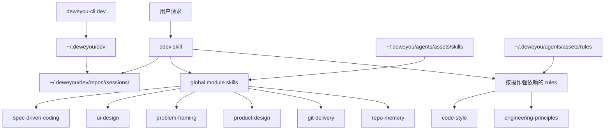

# DDev 框架技术方案

*状态：MVP 实施方案*

DDev 是 Dewey 个人跨仓库开发使用的 Agent Harness。它不是通用团队平台，
也不是一套更复杂的提示词。它给一次 Agent 开发会话提供很薄的本地运行时、
明确的 workflow owner，以及足够恢复、验证、交付和复盘的本地状态。

```text
DDev = Problem Framing + Harness + Demo + Loop + Evidence + Memory

Agent 入口：      ddev / $DDev，或项目 AGENTS.md 显式 opt-in
CLI 命名空间：    deweyou-cli dev ...
全局运行时：      ~/.deweyou/dev/
模块 skills：    ~/.deweyou/agents/assets/skills/<skill>/SKILL.md
强依赖 rules：   ~/.deweyou/agents/assets/rules/{code-style,engineering-principles}.md
按仓库状态：      ~/.deweyou/dev/repos/<repo-id>/
```

## 目标

- 为个人跨仓库开发提供一个默认工作流。
- 让任务上下文保持薄、准、可检查。
- 让分支上的工作可以恢复，但不把 runtime state 提交到仓库。
- 在完成声明或交付前显式记录验证证据。
- 让 brainstorm 变得具体：比较方向、压力测试取舍，并在有帮助时把想法变成
  本地 HTML demo。
- 让产品、UI、编码、交付、记忆 skills 放在全局 Dewey asset cache 中，
  作为一个生命周期下的模块能力。
- DDev 保持手动激活，避免和同一台机器上的其他 harness agents 冲突。
- DDev 的所有权只限于全局 `~/.deweyou/dev/` 状态和 DDev 自己的旧 hooks
  清理。

## 非目标

- MVP 不做通用 DAG / Node Runtime。
- MVP 不做机器 `state.json`、节点调度器、Review Node、subagent binding 或复杂恢复状态机。
- 不要求业务仓库提交 DDev runtime state。
- 不替代项目自己的测试、CI、lint、浏览器检查或 review。
- 不把 `product-notes` 和 `skill-eval` 耦合进默认开发链路。
- 默认不安装全局被动 hooks。
- 默认不依赖 Superpowers。DDev 可以吸收 Superpowers 的好流程；Superpowers
  只作为可选兼容后端或参考思路。

## 架构



### 控制面：`deweyou-cli dev`

CLI 负责确定性的本地基础设施：

- `install`：创建手动 runtime 和全局按仓库 session 文件。
- `status`：展示 runtime、repo state 和当前分支 session。
- `doctor`：诊断 runtime、全局模块 skill cache、session 文件、旧仓库本地状态、
  旧 git exclude，以及旧 DDev 被动 hooks 是否已移除。
- `clean`：删除 DDev 本地状态。
- `demo`：创建分支 session 的 `demo/index.html`，并可选启动本地静态 HTTP 服务。
- `record`：校验并追加 requirement、node、evidence、failure、review、recovery 或
  delivery 事件。
- `summary`：校验 `events.jsonl`，重新生成 `summary.md`，并输出 Markdown 或 JSON
  单 session 视图。
- `uninstall`：删除当前仓库全局状态、旧仓库本地状态、精确旧 git exclude 行、旧版
  DDev 被动 hooks，并且只在没有其他 repo state 时删除 runtime。

CLI 不负责判断产品行为、实现策略、是否完成，也不负责 commit、push、PR。

### 运行时：手动激活

MVP runtime 是手动激活的。`deweyou-cli dev install` 只准备本地状态，并移除旧版
DDev 被动 hooks；它不会新增 `SessionStart`、`UserPromptSubmit`、`Stop` 或其他
全局 Codex hook。

这样 DDev 可以安全地和同一台机器上的其他 harness agents 共存。某个仓库仍然可以
通过 `AGENTS.md` 把 DDev 设为默认工作流；这是项目级指令，不是设备级被动 hook。

### 工作流：`ddev`

`ddev` 拥有完整任务生命周期：

```text
Orient
  -> Problem framing, when exploration or Grilling is needed
  -> Early spec-driven-coding alignment for new or ambiguous behavior
  -> UI prototype gate, when requirement design touches UI
  -> Requirement alignment gate before product-source edits
  -> Capture task/context/graph/verification
  -> Harness map
  -> HTML demo, when visibility helps
  -> Execute bounded loop
  -> Evidence
  -> Delivery, when requested
  -> Retrospect and cleanup
```

其他 skills 是全局模块，位于 `~/.deweyou/agents/assets/skills/`，完成领域工作后
回到 `ddev`：

| 场景 | 模块 |
| --- | --- |
| Grilling、brainstorming、批判、推荐 | `problem-framing/SKILL.md` |
| 产品范围和取舍 | `product-design/SKILL.md` |
| UI 需求原型、交互、视觉证据 | `ui-design/SKILL.md` |
| 需求对齐、编码、调试、TDD、验证 | `spec-driven-coding/SKILL.md` |
| Commit、push、PR、CI | `git-delivery/SKILL.md` |
| 持久仓库知识 | `repo-memory/SKILL.md` |

`product-notes` 和 `skill-eval` 保持独立，只在明确请求时使用。

DDev 还拥有两个按操作生效的强依赖 rules。写、改、审代码前，必须读取
`~/.deweyou/agents/assets/rules/code-style.md`；进行模块设计、边界重构、依赖变更
或有架构影响的行为变更前，必须读取
`~/.deweyou/agents/assets/rules/engineering-principles.md`。即使用户没有把这两个
rules 全局安装或安装进仓库，DDev 也会直接从 asset cache 读取。若执行
`deweyou-cli agent update` 后对应文件仍缺失，则阻塞相关操作。

## 本地状态契约

```text
~/.deweyou/dev/
  config.json
  repos/
    <repo-id>/
      config.json
      sessions/
        <branch>/
          task.md
          brainstorm.md
          context.md
          graph.md
          decisions.md
          verification.md
          evidence.md
          demo.md
          demo/
            index.html
          retrospective.md
          events.jsonl
          summary.md
          stop-issues.txt
```

文件职责：

- `task.md`：目标、范围、非目标、验收标准、验收来源、对齐状态、未解决决策和当前状态。
- `brainstorm.md`：问题 frame、发散选项、批判、取舍和推荐方向。
- `context.md`：相关文件、命令、文档、约束和事实。
- `graph.md`：轻量依赖图或步骤清单。
- `decisions.md`：改变路径的决策和原因。
- `verification.md`：计划执行的验证 gate。
- `evidence.md`：claim、命令、截图、artifact、live check、缺口。
- `demo.md`：demo 路径、本地 URL、视觉检查和 demo 证据。
- `demo/index.html`：分支 session 静态 HTML demo 工作台。
- `retrospective.md`：候选 repo-memory 或 DDev 改进点。
- `events.jsonl`：append-only、带 schema 版本的协议事件。
- `summary.md`：生成的单 session 视图，汇总最新节点、claim、失败、Review、恢复建议、
  交付和未解决事项。
- `stop-issues.txt`：旧版或显式诊断留下的问题；MVP 不安装被动 Stop hook。

这些都是项目源码外的本地工作记忆。新版 DDev install 不写项目 `.gitignore` 或
`.git/info/exclude`；项目里的 `.deweyou/dev/` 只作为旧版遗留状态处理。

## MVP 里的 Artifact / Claim / Evidence

MVP 先做人可读版本：

- Artifact：产出或检查过的文件、diff、截图、报告、命令输出、PR、部署或 URL。
- Claim：DDev 声称为真的行为或状态。
- Evidence：证明、削弱或阻塞 claim 的检查或观察。

`evidence.md` 可以这样写：

```markdown
## Claims

- [verified] CLI install 会创建分支 session 文件。
- [verified] 旧版 DDev 被动 hooks 已从 Codex config 移除。

## Evidence

- `pnpm run typecheck:cli` 于 2026-07-08 通过。
- `pnpm --filter deweyou-cli test -- dev.test.ts args.test.ts` 通过。
- 目标环境仍需运行 `deweyou-cli dev install` 初始化手动 runtime。
```

非平凡 session 还可以使用一层很薄的机器协议，但不会替代这些人类可读文件：

```bash
deweyou-cli dev record --kind node --data \
  '{"node_id":"implement","node_type":"implementation","status":"completed"}'
deweyou-cli dev record --kind evidence --data \
  '{"evidence_id":"test-1","claim_id":"tests-pass","evidence_type":"command","status":"verified","summary":"Targeted tests passed."}'
deweyou-cli dev summary --format markdown
```

`record` 会在追加前校验 payload；`summary` 遇到损坏的持久化事件会明确失败，不会静默
丢弃证据。Failure 或 Review 事件可以携带 `restart_from`，但它只是恢复建议，不是自动
重试。

## MVP 里的轻量 DAG

MVP 使用 `graph.md`，不是调度器：

```markdown
# Graph

- [x] 追踪旧 harness 来源
- [x] 实现 CLI session 和手动 runtime 支持
- [ ] 更新 skills 和 docs
- [ ] 跑 assets 和 CLI 验证
- [ ] 安装并清理旧本地状态
```

更重的任务也可以写边：

```text
API contract -> server implementation -> UI integration -> E2E evidence
```

这个 graph 是给人恢复和推理用的，不代表 Node Runtime、自动调度或 subagent
binding。

## MVP 里的 Problem Framing

Grilling 和 brainstorming 由全局 `problem-framing` skill 承载。DDev 把它当模块
加载，而不是把所有创造性流程都塞进自己。

流程是：

1. Frame 问题、受众、约束、品味和非目标。
2. 发散出 3-5 个真正不同的方向。
3. 对每个方向做 tradeoff、失败模式和验证成本的压力测试。
4. 收敛到一个推荐方向和一个备用方向。
5. 判断本地 HTML demo 是否比继续写文字更能看清想法。

有本地状态时，把可复用的工作输出写到 `brainstorm.md`。原始发散过程保持临时，
然后把控制权交还给 DDev 处理 demo、证据、交付和清理。

当收敛后的需求包含 UI，DDev 会从全局 cache 加载 `ui-design` 做原型，再进入实现。
原型可以是页面/状态结构、原型图 prompt、组件级草图；如果交互或响应式需要被看见，
就用本地 HTML demo。

## MVP 里的需求对齐

新功能、用户可见行为变化和模糊产品请求必须在编辑产品源码前加载
`spec-driven-coding`。“请实现”只代表启动开发流程，不代表批准 Agent 推断出的需求。

DDev 记录三种对齐状态之一：

- `alignment_required`：关键行为缺失或由 Agent 推断；展示简短 spec，等待用户明确确认。
- `confirmed`：用户明确批准了相关需求、spec 或原型。
- `confirmation_not_required`：行为已经由用户或权威合同定义，或者用户明确委托了可逆、
  低风险的选择。

内部 notes 和原型只能证明 Agent 做过工作，不能证明用户已经确认。机械修改和已有明确
预期的窄 bugfix 可以继续，不需要无意义地等待确认。

## MVP 里的 HTML Demo

当概念需要被看见时，用本地 demo 工作台：

```bash
deweyou-cli dev demo --no-server
deweyou-cli dev demo --port 4173
```

demo 位于 `~/.deweyou/dev/repos/<repo-id>/sessions/<branch>/demo/index.html`，
属于本地工作状态。它适合产品草图、UI state、交互原型，以及在改产品代码前比较
brainstorm 方向。DDev 应把原型路径、本地 URL、视觉检查或明确缺口记录到
`demo.md` 和 `evidence.md`。

## MVP 命令

```bash
deweyou-cli dev install [--dry-run]
deweyou-cli dev status
deweyou-cli dev doctor
deweyou-cli dev clean [--branch name|--all] [--dry-run]
deweyou-cli dev demo [--branch name] [--host host] [--port port] [--no-server] [--dry-run]
deweyou-cli dev record [--branch name] --kind kind --data json
deweyou-cli dev summary [--branch name] [--format markdown|json]
deweyou-cli dev uninstall [--dry-run]
```

推荐仓库接入：

```bash
deweyou-cli agent update
deweyou-cli agent init \
  --skills ddev \
  --rules ddev-local-state,verification-evidence,loop-boundaries \
  --mode link \
  --yes
deweyou-cli dev install
deweyou-cli dev doctor
```

`code-style` 和 `engineering-principles` 是否全局或按项目安装，不影响 DDev；
DDev 会在对应操作发生时直接读取缓存中的 rule 文件。

## 所有权边界

DDev 只拥有：

- 创建 `~/.deweyou/dev/`
- 创建 `~/.deweyou/dev/repos/<repo-id>/`
- 删除旧版 DDev 被动 hooks
- 卸载时清理旧仓库本地 `<repo>/.deweyou/dev/`
- 卸载时删除精确旧 `.deweyou/dev/` 本地 git exclude 行

DDev 不检查、不诊断、不写 exclude，也不清理其他 harness agents 的本地状态。

## 未来再做

这些刻意不进 MVP：

- DAG / Node 调度器
- 可执行 Review Node
- subagent binding
- 复杂恢复状态机
- 多 session 报告生成
- 自动跨 session 分析和 Skill 改造
- Superpowers-style workflow 的可选兼容后端

采用条件和边界记录在 [`docs/ddev-evolution.md`](./ddev-evolution.md)。只有重复 session
证据证明轻量协议不够用时，才升级这些能力。

---
*Last updated: 2026-07-21 | Reason: Added validated session events, summaries, and evidence-based future capability triggers.*
