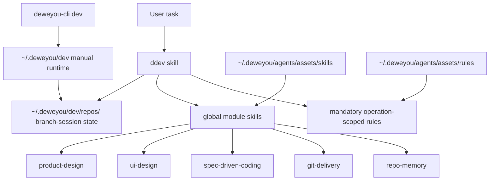

# DDev Operations Manual

*Last updated: 2026-07-20 | Reason: Documented mandatory cached rule dependencies alongside manual activation and project opt-in.*

This manual covers day-to-day DDev usage. See
[`docs/ddev-framework.md`](./ddev-framework.md) for the technical plan.

## Roles



- `ddev` is the task lifecycle owner.
- `deweyou-cli dev` installs, diagnoses, reports, cleans global DDev runtime
  state, and starts local demos.
- `~/.deweyou/dev/` is temporary local state outside project source, not project
  documentation.
- Other skills are global capability modules under
  `~/.deweyou/agents/assets/skills/` and return control to `ddev`.
- DDev reads `code-style` before code writing, editing, or review, and reads
  `engineering-principles` before architecture-impacting operations, directly
  from `~/.deweyou/agents/assets/rules/`.
- `product-notes` and `skill-eval` stay independent and explicit.
- DDev is manually triggered by default and does not install passive global
  hooks.

## Recommended Install

```bash
npm install -g deweyou-cli
deweyou-cli agent update
deweyou-cli agent init \
  --skills ddev \
  --rules ddev-local-state,verification-evidence,loop-boundaries \
  --mode link \
  --yes
deweyou-cli dev install
deweyou-cli dev doctor
```

Only `ddev` needs to be installed as the repository entry skill. Module skills
such as `problem-framing`, `ui-design`, `spec-driven-coding`, `git-delivery`,
`repo-memory`, and `product-design` stay in the global Dewey asset cache after
`deweyou-cli agent update`. DDev loads them by absolute path when needed.
Users may still install any module skill explicitly for standalone use.

Users do not need to install `code-style` or `engineering-principles` globally
or per repository for DDev. `deweyou-cli agent update` places both rule files in
the global asset cache, and DDev reads the applicable file before the matching
operation. If a required file is still absent after a cache refresh, DDev stops
that operation and reports the blocker.

`deweyou-cli dev install` prepares `~/.deweyou/dev`, writes the global module
registry into `~/.deweyou/dev/config.json`, creates the current repository's
state under `~/.deweyou/dev/repos/<repo-id>/`, then removes old DDev passive
hooks from earlier versions. It does not create project-local `.deweyou/dev/`,
does not add a new git exclude, and does not install new `SessionStart`,
`UserPromptSubmit`, or `Stop` hooks.

## Repository AGENTS.md Opt-In

To make DDev the default workflow for a repository, add this to `AGENTS.md`:

```markdown
## DDev Project Workflow

- This repository opts into DDev as the default workflow for non-trivial coding,
  product, and UI tasks.
- Treat those tasks as if the user wrote `$DDev ...` unless the user explicitly
  opts out.
- DDev is manually activated; do not rely on passive global hooks.
- Before starting DDev work, run `deweyou-cli dev doctor` or
  `deweyou-cli dev status`.
- If DDev is missing on this machine, stop and tell the user:
  `DDev is not installed. Run: npm install -g deweyou-cli; deweyou-cli agent update; deweyou-cli agent init --skills ddev --mode link --yes; deweyou-cli dev install`.
- Do not silently install DDev during an unrelated task.
```

To keep DDev explicit-only in a repository:

```markdown
## DDev Project Workflow

- Use DDev only when the user explicitly writes `$DDev` or `ddev`.
- DDev is manually activated; do not rely on passive global hooks.
```

Global installation makes the machine capable of running DDev. Whether a
repository uses DDev by default is decided by that repository's `AGENTS.md`.

## Daily Commands

```bash
deweyou-cli dev install
deweyou-cli dev status
deweyou-cli dev doctor
deweyou-cli dev clean --branch <branch>
deweyou-cli dev clean --all --dry-run
deweyou-cli dev demo --no-server
deweyou-cli dev demo --port 4173
deweyou-cli dev uninstall
```

`uninstall` removes the current repo's global state under
`~/.deweyou/dev/repos/<repo-id>/`, legacy repo-local `.deweyou/dev/` state if it
exists, the exact legacy local git exclude line, and old DDev passive hooks. It
removes the runtime root only when no other repository state remains. It does
not diagnose or manage other harness agents.

## Agent Entries

```text
$DDev <task>
$DDev brainstorm <topic>
$DDev demo <idea>
$DDev inspect <question>
$DDev setup
$DDev ship
$DDev retrospect
$DDev clean-context
$DDev uninstall
```

`$DDev <task>` runs the normal lifecycle: orient, grill, capture acceptance,
map the harness, execute bounded loops, collect evidence, and hand off only when
delivery or memory is needed.

When requirement design affects UI, DDev proactively loads the `ui-design`
module from the global cache to create the smallest useful prototype before
implementation. Use a screen/state
structure, prototype image prompt, component sketch, or local HTML demo depending
on what makes the decision visible.

`$DDev brainstorm <topic>` loads `problem-framing` from the global cache to
frame the problem, generate meaningfully different options, critique tradeoffs,
converge on a recommendation, and decide whether an HTML demo would clarify the
idea.

`$DDev demo <idea>` creates or updates the branch-session static HTML demo and can
serve it with `deweyou-cli dev demo`.

`$DDev inspect <question>` is read-only by default and should not create DDev
session state unless the user asks for a durable trail.

`$DDev setup` installs, diagnoses, or explains the DDev entry, global module
cache, and manual runtime with `deweyou-cli agent update`,
`deweyou-cli agent init --skills ddev --mode link --yes`,
`deweyou-cli dev install`, and `deweyou-cli dev doctor`.

`$DDev ship` hands delivery to `git-delivery`, keeps DDev global state out of
staging, leaves legacy project-local `.deweyou/dev/` unstaged if it appears,
protects unrelated dirty files, and reports commit, push, PR, CI, or blockers.

`$DDev retrospect` decides whether DDev session findings should become durable
repo memory. Do not copy temporary notes wholesale into docs.

`$DDev clean-context` summarizes or removes DDev-local state after confirmation.

`$DDev uninstall` runs `deweyou-cli dev uninstall` only on explicit request and
preserves unrelated harness hooks.

## Local State

```text
~/.deweyou/dev/
  config.json
  repos/
    <repo-id>/
      config.json
      sessions/
        <branch>/
          task.md
          brainstorm.md
          context.md
          graph.md
          decisions.md
          verification.md
          evidence.md
          demo.md
          demo/
            index.html
          retrospective.md
          events.jsonl
          stop-issues.txt
```

Rules:

- Keep DDev state under `~/.deweyou/dev/`, outside project git state.
- Do not add DDev ignores to project `.gitignore` or `.git/info/exclude` for
  new global-state installs.
- If project-local `.deweyou/dev/` exists, treat it as legacy state and leave it
  unstaged unless the user explicitly asks to version a fixture.
- Keep session files short and task-local.
- Use `brainstorm.md` for option framing, critique, and recommendation.
- Use `graph.md` for lightweight step or dependency tracking.
- Use `evidence.md` for claims, artifacts, commands, screenshots, live checks,
  skipped checks, and unresolved gaps.
- Use `demo/index.html` for throwaway local HTML demos before product code.
- Route durable knowledge to `repo-memory`, not to DDev state.

## Verification

Before DDev claims completion, answer:

- What behavior is being claimed?
- What is the smallest meaningful proof?
- Which commands or live checks ran?
- Which checks were skipped and why?
- Does UI/runtime work have screenshot, render, app, or browser evidence?

Common evidence levels:

| Level | Examples |
| --- | --- |
| Static | typecheck, lint, format, schema checks |
| Behavior | unit tests, integration tests, regression tests, builds |
| Live | browser screenshot, dev server, real app, CLI smoke, manual inspection |

## HTML Demo Workflow

1. Run `$DDev brainstorm <topic>` when the direction is still open.
2. For UI requirements, let `ui-design` define the prototype structure and
   states before editing files.
3. Run `deweyou-cli dev demo --no-server` to create the demo workspace.
4. Edit `~/.deweyou/dev/repos/<repo-id>/sessions/<branch>/demo/index.html`.
5. Run `deweyou-cli dev demo --port 4173`.
6. Verify the page in a browser and record the result in `demo.md` and
   `evidence.md`.

## New Repository Checklist

1. Install or upgrade the global CLI: `npm install -g deweyou-cli@latest`.
2. In the target repository, run `deweyou-cli agent update`.
3. Run `deweyou-cli agent init --skills ddev --mode link --yes`.
4. Choose either DDev-by-default or explicit-only DDev in `AGENTS.md`.
5. Run `deweyou-cli agent context --format markdown`.
6. Run `deweyou-cli dev install`.
7. Run `deweyou-cli dev doctor`.
8. Confirm `deweyou-cli dev status` points at `~/.deweyou/dev/repos/<repo-id>`.
9. Confirm project-local `.deweyou/dev/` was not created.
10. Use `$DDev inspect` for a read-only repo orientation.
11. Use a small docs or test task for the first `$DDev <task>` session.
12. Use `$DDev retrospect` to decide whether repo-memory is needed.

## Upgrade And Iteration

After the first release, daily upgrades use the same path:

```bash
npm install -g deweyou-cli@latest
deweyou-cli agent update
deweyou-cli agent init \
  --skills ddev \
  --rules ddev-local-state,verification-evidence,loop-boundaries \
  --mode link \
  --yes
deweyou-cli dev install
deweyou-cli dev doctor
```

When a trial in another repository reveals a problem, bring back the symptom,
repository, command output, relevant
`~/.deweyou/dev/repos/<repo-id>` session summary, or screenshot. Iterate the
DDev skill, rules, docs, or CLI in this repository, cut a new release, then
rerun the upgrade commands in the target repository.

## Troubleshooting

| Symptom | Action |
| --- | --- |
| `.deweyou/dev/` looks like an unknown repo file | Treat it as legacy DDev repo-local state; leave it unstaged and run `deweyou-cli dev uninstall` only when you want DDev to clean legacy state. |
| DDev command is missing | Install or upgrade with `npm install -g deweyou-cli@latest`, then run `deweyou-cli agent update`. |
| Repository does not trigger DDev | Check whether `AGENTS.md` opted into DDev by default; otherwise invoke `$DDev ...` explicitly. |
| Other harness agents are installed | Keep DDev manually triggered; DDev does not inspect or clean their local state. |
| DDev session gets long or noisy | Use `$DDev retrospect` to extract durable knowledge, then `$DDev clean-context`. |
| A module skill takes over the lifecycle | Return to `ddev`; keep that skill's output as domain evidence. |
| Verification is slow | Pick the lowest evidence level that proves the current claim and leave slower checks as delivery or CI follow-up. |

## Maintenance

After changing skills, rules, or design contracts:

```bash
pnpm run lint:assets
```

After changing CLI behavior:

```bash
pnpm run typecheck:cli
pnpm run test:cli
pnpm run coverage:cli
cd cli && npm pack --dry-run
```
