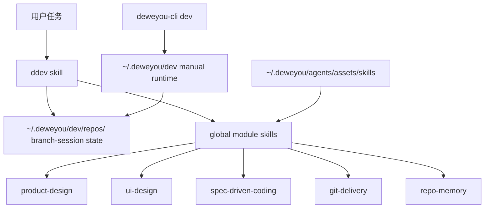

# DDev 操作手册

*Last updated: 2026-07-20 | Reason: Documented manual activation, project opt-in, upgrade, and uninstall flow.*

这份手册面向日常跨仓库开发使用。技术方案见
[`docs/ddev-framework.zh.md`](./ddev-framework.zh.md)。

## 角色分工



- `ddev` 是任务生命周期 owner。
- `deweyou-cli dev` 负责安装、诊断、状态展示、清理全局 DDev runtime 和启动本地
  demo。
- `~/.deweyou/dev/` 是项目源码外的本地临时状态，不是项目文档。
- 其他 skills 是全局能力模块，放在 `~/.deweyou/agents/assets/skills/`
  下，完成领域工作后回到 `ddev`。
- `product-notes` 和 `skill-eval` 保持独立，只在明确请求时使用。
- DDev 默认是用户主动触发，不安装全局被动 hooks。

## 推荐安装

```bash
npm install -g deweyou-cli
deweyou-cli agent update
deweyou-cli agent init \
  --skills ddev \
  --rules ddev-local-state,verification-evidence,loop-boundaries \
  --mode link \
  --yes
deweyou-cli dev install
deweyou-cli dev doctor
```

每个仓库只需要把 `ddev` 作为入口 skill 安装进去。`problem-framing`、
`ui-design`、`spec-driven-coding`、`git-delivery`、`repo-memory` 和
`product-design` 等模块 skills 由 `deweyou-cli agent update` 放在全局 Dewey
asset cache，DDev 需要时按绝对路径加载。用户仍然可以为了单独使用某个模块
skill，把它显式安装到某个 harness 或仓库里。

`deweyou-cli dev install` 会准备 `~/.deweyou/dev`，把全局模块 registry 写入
`~/.deweyou/dev/config.json`，并把当前仓库状态创建在
`~/.deweyou/dev/repos/<repo-id>/` 下，然后移除旧版 DDev 被动 hooks；它不会创建
项目本地 `.deweyou/dev/`，不会新增 git exclude，也不会新装 `SessionStart`、
`UserPromptSubmit` 或 `Stop` hooks。

## 仓库 AGENTS.md 接入

如果希望某个仓库默认走 DDev，把下面这段放进仓库 `AGENTS.md`：

```markdown
## DDev Project Workflow

- This repository opts into DDev as the default workflow for non-trivial coding,
  product, and UI tasks.
- Treat those tasks as if the user wrote `$DDev ...` unless the user explicitly
  opts out.
- DDev is manually activated; do not rely on passive global hooks.
- Before starting DDev work, run `deweyou-cli dev doctor` or
  `deweyou-cli dev status`.
- If DDev is missing on this machine, stop and tell the user:
  `DDev is not installed. Run: npm install -g deweyou-cli; deweyou-cli agent update; deweyou-cli agent init --skills ddev --mode link --yes; deweyou-cli dev install`.
- Do not silently install DDev during an unrelated task.
```

如果希望某个仓库避免默认接管，只保留显式入口：

```markdown
## DDev Project Workflow

- Use DDev only when the user explicitly writes `$DDev` or `ddev`.
- DDev is manually activated; do not rely on passive global hooks.
```

也就是说，全局安装只是让电脑具备 DDev；某个仓库是否默认走 DDev，由该仓库
`AGENTS.md` 决定。

## 常用命令

```bash
deweyou-cli dev install
deweyou-cli dev status
deweyou-cli dev doctor
deweyou-cli dev clean --branch <branch>
deweyou-cli dev clean --all --dry-run
deweyou-cli dev demo --no-server
deweyou-cli dev demo --port 4173
deweyou-cli dev uninstall
```

`uninstall` 会删除当前仓库在 `~/.deweyou/dev/repos/<repo-id>/` 下的全局状态、
旧版项目本地 `.deweyou/dev/` 状态、精确的旧 git exclude 行，并清除旧版 DDev
被动 hooks；只有没有其他 repo state 时才会删除 runtime root；不会诊断或管理其他
harness agents。

## Agent 入口

```text
$DDev <task>
$DDev brainstorm <topic>
$DDev demo <idea>
$DDev inspect <question>
$DDev setup
$DDev ship
$DDev retrospect
$DDev clean-context
$DDev uninstall
```

`$DDev <task>` 跑正常生命周期：摸底、Grilling、验收、harness map、
有边界实现循环、收集证据，并且只在需要时交给交付或 memory。

当需求设计影响 UI 时，DDev 会从全局 cache 加载 `ui-design`，先做最小可用原型，
再进入实现。根据问题需要，原型可以是页面/状态结构、原型图 prompt、组件草图或
本地 HTML demo。

`$DDev brainstorm <topic>` 会从全局 cache 加载 `problem-framing` 来 frame 问题、
发散不同方向、批判 tradeoff、收敛到推荐方案，并判断 HTML demo 是否比继续写文字
更有帮助。

`$DDev demo <idea>` 会创建或更新分支 session 静态 HTML demo，并可通过
`deweyou-cli dev demo` 启动本地服务。

`$DDev inspect <question>` 默认只读，不创建 DDev session state，除非用户
要求保留调查轨迹。

`$DDev setup` 用 `deweyou-cli agent update`、
`deweyou-cli agent init --skills ddev --mode link --yes`、
`deweyou-cli dev install` 和 `deweyou-cli dev doctor` 安装、诊断或解释
DDev 入口、全局模块 cache 和手动 runtime。

`$DDev ship` 把交付交给 `git-delivery`，保持 DDev 全局状态不进入 staging；
如果项目本地 `.deweyou/dev/` 作为遗留状态出现，也默认不 staging；同时保护无关
dirty files，并报告 commit、push、PR、CI 或 blocker。

`$DDev retrospect` 判断哪些 session 发现应该变成持久 repo memory。不要把
临时 notes 整体搬进 docs。

`$DDev clean-context` 在确认后总结或删除 DDev 本地状态。

`$DDev uninstall` 只在用户明确请求时运行 `deweyou-cli dev uninstall`，
并保留无关 harness hooks。

## 本地状态

```text
~/.deweyou/dev/
  config.json
  repos/
    <repo-id>/
      config.json
      sessions/
        <branch>/
          task.md
          brainstorm.md
          context.md
          graph.md
          decisions.md
          verification.md
          evidence.md
          demo.md
          demo/
            index.html
          retrospective.md
          events.jsonl
          stop-issues.txt
```

规则：

- DDev 状态放在 `~/.deweyou/dev/`，位于项目 git 状态之外。
- 新版全局状态 install 不向项目 `.gitignore` 或 `.git/info/exclude` 新增 DDev
  ignore。
- 如果项目本地 `.deweyou/dev/` 存在，把它当旧版遗留状态处理；除非用户明确要把某个
  fixture 版本化，否则不 staging。
- session 文件保持短、小、当前任务相关。
- `brainstorm.md` 记录方向 frame、批判和推荐。
- `graph.md` 记录轻量步骤或依赖关系。
- `evidence.md` 记录 claim、artifact、命令、截图、live check、跳过的检查和缺口。
- `demo/index.html` 用于进入产品代码前的本地 HTML demo。
- 持久知识进 `repo-memory`，不留在 DDev 本地状态里。

## 验证

DDev 声称完成前至少回答：

- 这次声明完成的行为是什么？
- 哪个最小验证能证明它？
- 已运行哪些命令或 live checks？
- 哪些验证没跑，原因是什么？
- 如果是 UI/浏览器/运行时行为，有没有截图、渲染或 live runtime 证据？

常见证据层级：

| 层级 | 示例 |
| --- | --- |
| 静态 | typecheck、lint、format、schema checks |
| 行为 | 单测、集成测试、回归测试、构建 |
| 现场 | browser screenshot、dev server、真实 app、CLI smoke、人工检查 |

## HTML Demo 流程

1. 方向还没定时，先跑 `$DDev brainstorm <topic>`。
2. 如果是 UI 需求，先让 `ui-design` 定义原型结构和状态，再编辑文件。
3. 运行 `deweyou-cli dev demo --no-server` 创建 demo 工作台。
4. 编辑 `~/.deweyou/dev/repos/<repo-id>/sessions/<branch>/demo/index.html`。
5. 运行 `deweyou-cli dev demo --port 4173`。
6. 在浏览器里验证页面，并把结果写入 `demo.md` 和 `evidence.md`。

## 新仓库接入检查

1. 安装或升级全局 CLI：`npm install -g deweyou-cli@latest`。
2. 在目标仓库运行 `deweyou-cli agent update`。
3. 运行 `deweyou-cli agent init --skills ddev --mode link --yes` 安装 DDev 入口。
4. 在 `AGENTS.md` 里选择“默认走 DDev”或“仅显式 `$DDev` 触发”。
5. 运行 `deweyou-cli agent context --format markdown` 查看生效资产。
6. 运行 `deweyou-cli dev install`。
7. 运行 `deweyou-cli dev doctor`。
8. 确认 `deweyou-cli dev status` 指向 `~/.deweyou/dev/repos/<repo-id>`。
9. 确认项目本地 `.deweyou/dev/` 没有被创建。
10. 用 `$DDev inspect` 做一次只读仓库摸底。
11. 用一个小 docs 或测试任务跑 `$DDev <task>`。
12. 任务结束后用 `$DDev retrospect` 判断是否需要 repo-memory。

## 升级和迭代

发布第一版后，日常升级走同一条链路：

```bash
npm install -g deweyou-cli@latest
deweyou-cli agent update
deweyou-cli agent init \
  --skills ddev \
  --rules ddev-local-state,verification-evidence,loop-boundaries \
  --mode link \
  --yes
deweyou-cli dev install
deweyou-cli dev doctor
```

如果在其他仓库试跑发现问题，把现象、仓库、命令输出、
`~/.deweyou/dev/repos/<repo-id>` 里相关 session 摘要或截图带回来，在本仓库迭代
DDev skill、rules、docs 或 CLI。修完后重新发版，再在目标仓库执行上面的升级命令。

## 故障处理

| 现象 | 处理 |
| --- | --- |
| `.deweyou/dev/` 看起来像未知仓库文件 | 当作旧版 DDev 仓库本地状态处理，默认不 staging；只有想让 DDev 清理旧状态时才运行 `deweyou-cli dev uninstall`。 |
| DDev 命令不存在 | 先安装或升级 `npm install -g deweyou-cli@latest`，再运行 `deweyou-cli agent update`。 |
| 仓库没有触发 DDev | 检查 `AGENTS.md` 是否写了默认 opt-in；没有的话需要显式输入 `$DDev ...`。 |
| 同机有其他 harness agents | 保持 DDev 手动触发；DDev 不检查也不清理它们的本地状态。 |
| DDev session 变长变乱 | 用 `$DDev retrospect` 抽取 durable knowledge，再 `$DDev clean-context`。 |
| 模块 skill 抢走生命周期 | 回到 `ddev`，把该 skill 的结果当领域证据。 |
| 验证过慢 | 选择能证明当前声明的最低证据层级，把慢检查放到交付前或 CI 后续。 |

## 维护

修改 skills、rules 或 design contracts 后运行：

```bash
pnpm run lint:assets
```

修改 CLI 行为后运行：

```bash
pnpm run typecheck:cli
pnpm run test:cli
pnpm run coverage:cli
cd cli && npm pack --dry-run
```
