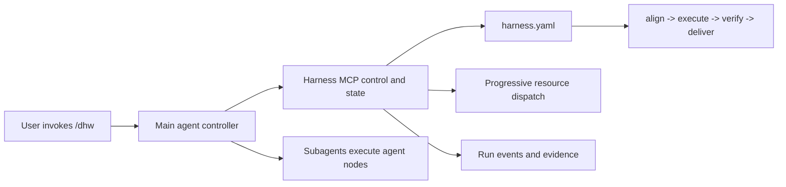

# Harness Core

Deweyou Harness separates orchestration from domain behavior. The Codex Plugin
ships `/dhw` and a local stdio MCP server. A workspace owns everything else in
`harness.yaml`.



## Configuration

The schema is [harness.schema.json](../schemas/harness.schema.json). Editors can
associate that schema with `harness.yaml`.

```yaml
version: 1

imports:
  - path: packages/shared/harness.yaml
    as: shared

resources:
  editorial-rule:
    kind: rule
    source:
      type: workspace
      path: .agents/rules/editorial.md
  research:
    kind: knowledge
    source:
      type: git
      repo: https://github.com/acme/knowledge.git
      path: launch/research.md
      ref: main
  article-writer:
    kind: skill
    source:
      type: registry
      repo: acme/agent-skills
      skill: article-writer

nodes:
  draft:
    executor:
      type: agent
      skills: [article-writer]
  verify-copy:
    executor:
      type: agent
  render:
    executor:
      type: command
      command: pnpm render

workflows:
  publish-article:
    name: Publish article
    description: Draft, verify, and deliver an article for an approved channel.
    rules: [editorial-rule]
    knowledge: [research]
    stages:
      execute:
        - use: draft
        - use: render
          needs: [draft]
      verify:
        - use: verify-copy
```

This configuration is illustrative documentation, not a bundled workflow. The
plugin does not ship any of these resources.

### Sources

- `workspace`: `path` is relative to the config that declares it. The loader
  resolves it before merging imports.
- `registry`: `repo` and `skill` are the fixed `npx skills` parameters. The
  dispatcher looks for an already installed skill in workspace and user skill
  roots. When absent it returns the exact `npx skills add` hint; it never
  installs silently. The receipt also contains a structured command and argument
  list for an approved preparation step.
- `git`: `repo`, `path`, and optional `ref` identify a cached Git resource.
  Local/file repositories resolve directly. A missing remote cache produces a
  structured shallow-clone preparation step rather than a hidden network side
  effect.

There is no `entry`, provider, version, or `resource_loading` field.

### Imports And Inheritance

Imports are recursive and paths are relative to the declaring config. `as`
namespaces imported resource, node, and workflow IDs and rewrites internal
references. Import cycles and collisions fail validation; local definitions do
not silently override imports.

A workflow may `extends` one workflow. The child must still define its own
`name` and `description`. Missing fields and stages inherit. A declared stage,
`rules`, or `knowledge` list replaces the inherited value. There is no deep
merge, multiple inheritance, or inheritance cycle.

### Workflows And Nodes

Workflows may use any subset of four canonical stages: `align`, `execute`,
`verify`, and `deliver`. Their order and transitions are fixed, not configured.
Each stage contains reusable node instances. `needs` may refer only to another
instance in the same stage, forming a validated DAG.

An `agent` executor may reference zero or more skill resources. Zero means a
pure agent node. The `/dhw` controller gives one non-trivial agent-node
execution to one subagent. A `command` executor is run deterministically by the
controller under host safety and approval rules.

## Progressive Dispatch

Dispatch is the only loading mechanism:

1. Workflow selection loads rules in full and knowledge metadata only.
2. Activating an agent node loads its skill `SKILL.md` files in full.
3. Knowledge bodies and skill supporting files load only on demand.
4. Every activation creates a receipt with locator, mode, and digest; passing
   the Run ID updates `resources.lock.json` atomically.
5. Resume, handoff, and context compaction redispatch workflow rules, knowledge
   metadata, current-node skills, and previously activated resources.

## Runtime Loop

The fixed loop is align → execute → verify → deliver. Verification rejection
returns to execute; a material objective error returns to align; delivery
rejection returns to execute. v0.1 allows at most two attempts for a node in one
stage and three visits to one stage. Only retryable technical failures retry.

Every rerun is additive:

- `stageVisit` identifies one visit to a stage.
- `nodeExecutionId` identifies one execution, never a reusable node.
- `attempt` identifies the attempt within its stage visit and node.
- each execution keeps its own timestamps, duration, trace, span, and evidence.

Aggregates distinguish execution time, retry time, rework time, and Run wall
time. A started execution without a terminal event becomes `interrupted` on
resume; it is never silently reset.

## Run Data

New state lives only under `~/.deweyou/harness/`:

```text
workspaces/<workspace-id>/runs/<run-id>/
  run.json
  request.json
  config.snapshot.yaml
  resources.lock.json
  plan.json
  events.jsonl
  state.json
  evidence/<sha256>
  artifacts.json
  retrospective.json
  proposals/<proposal-id>.json
```

`workspace-id` hashes the canonical workspace path and does not require Git.
The durable unit is a Run; host sessions are metadata. `events.jsonl` is an
append-only, sequence-checked, hash-chained source of truth. A lock serializes
writers and idempotency keys deduplicate retried appends. `state.json` is an
atomic, rebuildable projection. The initial event records planned node
instances so the projection can show pending, ready, running, and terminal
progress without consulting chat history.

Dashboard, retrospectives, and evaluations must consume only Run bundles. Do
not store secrets, environment dumps, unrelated raw conversations, or large raw
logs in events. Store content-addressed evidence and keep structured event
summaries redacted.

## Post-delivery Retrospective

Appending `run.completed` triggers a fixed Core hook; it is not a fifth stage
and adds nothing to `harness.yaml`. The hook analyzes explicit resource
feedback and resource-attributed failure or verification events. It always
writes `retrospective.json`, but creates proposals only when evidence identifies
a specific skill, rule, or knowledge resource.

Each proposal records the resource ID and base digest, evidence event IDs,
problem categories, a domain-neutral review suggestion, and a replay acceptance
condition. The controller reads proposals with `retrospective_get` and asks the
user whether to update now, retain the proposal, or reject it. An accepted
proposal starts a separate maintenance Run; Core never mutates resources
directly. Proposal and retrospective formats are defined by
[resource-proposal.schema.json](../schemas/resource-proposal.schema.json) and
[retrospective.schema.json](../schemas/retrospective.schema.json).

## MCP Tools

- `config_inspect`
- `run_create`
- `run_get`
- `event_append`
- `ready_nodes`
- `resources_dispatch`
- `run_rehydrate`
- `evidence_record`
- `retrospective_get`
- `proposal_decide`

The MCP server does not choose a workflow, launch a subagent, or perform user
judgment. Those remain controller responsibilities.

## Distribution Boundary

v0.1 is a Codex Plugin, not a public CLI. Plugin installation/update distributes
the skill, schemas, and bundled MCP server together. Other host/plugin formats
and a dashboard may be added later without changing the Core contracts.

Old `~/.deweyou/dev/` state is intentionally ignored. The plugin contains no
migration, compatibility command, or cleanup path for it.
