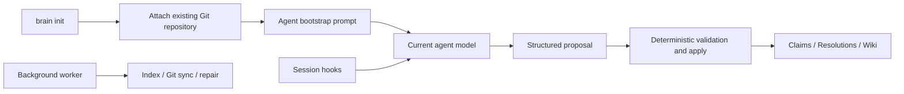

# Context Hub Agent-Driven Lifecycle



> Status: confirmed
>
> Acceptance source: the user confirmed the agent-driven lifecycle and
> non-destructive repository attachment in this task.

## Goal

Use the model already running inside Codex, Claude Code, Hermes, OpenClaw, or
Trae to initialize and maintain durable knowledge. Keep repository attachment,
validation, indexing, and Git convergence deterministic.

## Non-goals

- Do not import discovered session history during `brain init`.
- Do not copy raw transcripts into the Git knowledge repository.
- Do not call an external model from the background worker.
- Do not reset, clean, overwrite, rebase, or create a non-fast-forward merge in
  an existing repository during initialization.
- Do not run semantic maintenance on every tool event.

## CLI Contract

### Repository attachment

`brain init` collects the repository path, device id, optional remote, and
branch. When a remote is configured, it reconciles before writing managed
files:

1. clone a non-empty remote branch into an absent or empty target;
2. fetch an existing repository only when its worktree is clean and `origin`
   matches;
3. fast-forward the configured branch when possible;
4. retain a local-ahead branch unchanged;
5. stop on dirty, mismatched, wrong-branch, or diverged repositories;
6. retain every existing file and add only missing Deweyou files;
7. never push from `brain init`.

An empty remote may be attached to an existing local repository without
changing its files.

### Agent bootstrap

`deweyou-cli brain bootstrap --agent <agent>` prints an agent-specific prompt.
The command is read-only. The prompt tells the current agent to:

- inspect the attached knowledge repository and current session;
- install or verify only its own adapter;
- capture a concise bootstrap observation when durable knowledge exists;
- request a maintenance prompt;
- emit schema-constrained proposals and submit them through `brain apply`;
- synchronize only after structured maintenance has been applied;
- keep local history local and avoid bulk session import.

`brain init` prints the bootstrap commands as its next step.

### Agent maintenance

`brain maintain [--agent <agent>] [--session <id>]` deterministically
materializes pending Observations and prints a model-facing maintenance prompt.
It never invokes a model.

Stop-equivalent hooks return the same prompt to the current agent. Context
hooks prepend both the normal Context Pack and unfinished maintenance from an
earlier hook, so adapters that cannot re-enter the model at session end still
converge on the next turn.

`brain apply --data <json>` and `brain apply --data-file <path>` validate one
proposal against its pending job, apply the existing governance schema, remove
only the completed job, rebuild the Wiki, and refresh the local index.

### Background operations

`brain worker` may compile deterministic views, rebuild the local index, and
synchronize Git. It does not materialize semantic Observations, call a model
provider, or create Claims.

The macOS schedule is described as background sync and index maintenance.

## Storage

Raw transcript content is written only below:

```text
~/.deweyou/brain/raw-sources/
```

The Git repository receives a Source manifest containing identity, scope,
classification, content hash, and byte count—not the transcript body.
Maintenance prompts may point the current agent at the local raw-source path.
Secret-like inputs remain quarantined locally.

## Acceptance Criteria

1. Attaching a clean existing repository fast-forwards before adding missing
   templates and preserves unrelated files.
2. Dirty, wrong-branch, mismatched-origin, and diverged repositories are left
   untouched with actionable errors.
3. Interactive init performs no history discovery, import, hook installation,
   schedule installation, commit, or push.
4. Bootstrap commands print tailored, read-only prompts for every supported
   agent.
5. Stop hooks expose a structured maintenance prompt; start/prompt hooks expose
   unfinished maintenance plus scoped recall.
6. No Claim can be created without `brain apply` passing deterministic
   validation for an existing pending job.
7. Raw transcript text is absent from the Git repository and present only in
   the local runtime.
8. The background worker succeeds with no compiler command and cannot invoke
   one.
9. CLI help, English docs, Chinese docs, and adapter documentation describe the
   same lifecycle.

---
*Last updated: 2026-07-27 | Reason: Confirmed agent-driven Context Hub lifecycle*
