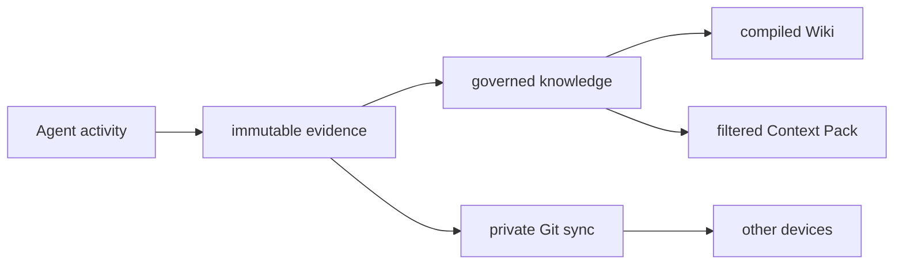

# Context Hub V1 Design



> Status: confirmed
>
> Acceptance source: the user approved implementation after the multi-round
> architecture discussion in this task.

## Goal

Build a local-first, cross-device, cross-agent personal Context Hub in this
repository. `deweyou-cli` owns the runtime, governance policy, Git transport,
local index, context planning, and agent adapters. The personal knowledge
content lives in a separate private Git repository selected in local
configuration.

The system continuously turns durable agent activity and sources into governed
knowledge:

```text
Agent event
  -> immutable source/event
  -> observation
  -> structured resolution operation
  -> claim/decision
  -> compiled Markdown Wiki
  -> scope-filtered Context Pack
```

## Non-goals

- Do not copy SQLite, FTS, vectors, queues, locks, or caches through Git.
- Do not make a single agent's private session format the canonical schema.
- Do not let a model freely rewrite claim history.
- Do not block an active agent task on remote fetch, model compilation, or push.
- Do not add a graph database or vector database in V1.
- Do not publish the canonical private repository directly to shared consumers.
- Do not treat frontmatter classification as encryption or as permission to
  store credentials.

## Confirmed Product Behavior

### Storage

- `~/.deweyou/brain/config.yaml` identifies the local knowledge repository and
  device.
- The knowledge repository commits normalized sessions, sources, events,
  observations, claims, resolutions, decisions, Wiki pages, and policy files.
- The local runtime stores derived state under `~/.deweyou/brain/`.
- GitHub private repositories may store plaintext. The configuration reserves
  `none`, `sensitive-only`, and `all` encryption modes, but V1 implements
  `none` and rejects unsupported modes.
- Secret-like input is quarantined locally and is not committed.

### Knowledge lifecycle

Artifacts use `active`, `stale`, `superseded`, `archived`, and `deleted`
states. Normal forgetting is soft:

- stale knowledge is down-ranked and labeled;
- superseded knowledge remains traceable but is not recalled by default;
- archived knowledge is cold and appears only in explicit historical search;
- deleted knowledge is excluded from recall and compilation while retaining a
  tombstone;
- hard purge is an explicit emergency workflow for accidentally captured
  secrets and is not part of routine maintenance.

### Classification and scope

Every durable artifact carries both fields:

```yaml
scope:
  - personal
  - domain/finance
classification: confidential
```

Classification order is:

```text
public < private < confidential < restricted
```

- Missing classification inherits the nearest domain default and ultimately
  falls back to `private`.
- Unknown classifications fail validation and cannot be exported.
- A consumer receives an artifact only when its clearance is high enough and
  its allowed scopes match.
- Filtering occurs before context assembly or model invocation.
- Derived artifacts inherit the highest classification of their inputs.
- Models may raise classification but may not lower it.

### Runtime and hooks

- Hook handlers capture quickly and fail open: inability to reach Git or a
  model never blocks the active agent.
- A local worker performs indexing, reconciliation, Wiki compilation, fetch,
  rebase, commit, and push outside the active agent path.
- `SessionStart` receives a small L0 context. Task-specific L1/L2 context is
  recalled on demand.
- The core adapter contract is shared by Codex, Claude Code, Hermes Agent,
  OpenClaw, and Trae. Each adapter uses the strongest native surface available:
  lifecycle hooks, memory provider/plugin, MCP, instructions, or historical
  import.

## Repository Boundaries

### This repository

```text
cli/src/cli/brain-*.ts     Runtime and CLI implementation
cli/src/cli/brain-adapters Agent-specific installation and normalization
docs/                      Architecture and operations
```

### Personal knowledge repository

```text
AGENTS.md
brain.yaml
schemas/
policy/
devices/
events/<device-id>/
sources/sessions/<agent>/
observations/
claims/
resolutions/
decisions/
wiki/
  index.md
  journal/
  domains/<domain>/
    purpose.md
```

### Local derived runtime

```text
~/.deweyou/brain/
  config.yaml
  brain.sqlite
  queue/
  quarantine/
  locks/
  context-packs/
```

## CLI Contract

```text
deweyou-cli brain init
deweyou-cli brain init --repo <path> [--device <id>] [--remote <url>]
deweyou-cli brain status
deweyou-cli brain capture --agent <agent> --event <event> [--data <json>]
deweyou-cli brain import --discover [--dry-run] [--agent codex|hermes]
deweyou-cli brain import --agent <agent> --path <file-or-directory>
deweyou-cli brain index
deweyou-cli brain recall --query <text> [--scope <scope>] [--budget <tokens>]
deweyou-cli brain export --output <path> [--clearance <level>] [--scope <scope>]
deweyou-cli brain state --id <id> --status <state> --reason <text>
deweyou-cli brain maintain
deweyou-cli brain sync
deweyou-cli brain worker
deweyou-cli brain schedule install|status|uninstall
deweyou-cli brain hook install --agent <agent|all>
deweyou-cli brain hook status [--agent <agent|all>]
deweyou-cli brain hook uninstall --agent <agent|all>
```

Hook commands support `--dry-run`. Hook installation is reversible, preserves
unrelated user configuration, and detects owned entries using stable Deweyou
command markers. The OpenClaw adapter records its local activation state.
Codex installation also enables `[features].hooks = true` without bypassing
its user trust review. Trae supports an explicit repository-local
`--repo <path>` target and treats the user-level path as compatibility-only.

Without `--repo`, `brain init` is an interactive terminal wizard. It collects
the knowledge repository, device id, optional private Git remote, and branch,
then offers opt-in Codex/Hermes historical import, global agent hooks, and the
macOS worker. These side effects are unselected by default. Non-interactive
shells must pass `--repo`.

Native Codex/Hermes discovery opens framework-owned stores read-only and
normalizes user messages and user-visible assistant message content. It
excludes system/developer prompts, reasoning, tool output, and device metadata.
The default imported classification/scope is `private` and
`device/<device-id>`. Stable source/session identities make repeated import
idempotent.

Raw Events and Sources containing a device-local `cwd` are constrained to the
current `device/<id>` scope. Requested personal/project scopes are kept as
governance hints so a resolver can emit a separate cross-device Claim without
propagating the absolute path.

## Structured governance operations

Model providers may return only:

- `ADD_CLAIM`
- `MERGE_CLAIMS`
- `SUPERSEDE_CLAIM`
- `SPLIT_SCOPE`
- `MARK_STALE`
- `LINK_ENTITIES`
- `REJECT_OBSERVATION`
- `REQUEST_HUMAN_DECISION`

Every proposal records its deterministic job id, input ids, evidence,
confidence, provider/model version, policy version, and device id. Proposals
are immutable. Reconciliation validates operations and emits a canonical
resolution or a human decision request.

## Git convergence

1. Capture writes only immutable paths under the current device namespace.
2. Sync commits durable local changes before contacting the remote.
3. Sync fetches and rebases on the configured remote branch.
4. Conflicts confined to generated `wiki/` paths are resolved by retaining the
   rebased ledger and regenerating the Wiki.
5. Concurrent canonical resolutions for the same deterministic job preserve
   every device proposal and select the lexicographically smallest proposal
   path. Claims unique to a losing proposal are retained but ineffective.
6. Any conflict in canonical source, event, claim identity, or decision paths
   aborts the rebase and returns a diagnostic without pushing.
7. Push rejection triggers a bounded fetch/rebase/rebuild retry.
8. SQLite is incrementally rebuilt after successful reconciliation.

## Acceptance criteria

1. `brain init` creates a valid private runtime configuration and a portable
   knowledge repository with the documented entrypoints and policies.
2. Two simulated devices can append events without sharing mutable filenames.
3. Capture rejects or quarantines secret-like content and returns without
   performing network work.
4. Markdown frontmatter and JSON artifacts are validated for classification,
   scope, status, identity, and source references.
5. SQLite FTS5 is local-only, incremental, rebuildable, and never staged by the
   Git transport.
6. Recall enforces clearance and scope before returning L0/L1/L2 entries and
   respects a token budget.
7. Structured operations are validated; invalid or unauthorized downgrades do
   not mutate knowledge.
8. Wiki compilation is deterministic and propagates the highest input
   classification.
9. Sync is idempotent, bounded, and preserves local work on failure.
10. Hook install/status/uninstall covers Codex, Claude Code, Hermes Agent,
    OpenClaw, and Trae using native or documented fallback integration.
11. Tests cover normal, malformed, secret, scope leakage, concurrent-device,
    generated-Wiki conflict, retry, and downgrade cases.
12. Interactive initialization is opt-in for history, hooks, and scheduling;
    native Codex/Hermes discovery is read-only, privacy-normalized, and
    idempotent.
13. Architecture, configuration, operations, adapter support, and recovery
    documentation are complete in English and Chinese where user operation is
    involved.

## Verification

```bash
pnpm run typecheck:cli
pnpm run test:cli
pnpm run coverage:cli
cd cli && npm pack --dry-run
pnpm test
pnpm run lint:assets
```

The final audit also creates temporary test homes and knowledge repositories,
runs the public CLI through init/capture/index/recall/hook dry-runs, and verifies
that no local runtime database or secret is staged.

Implementation references:
[Brain CLI](../../../cli/src/cli/brain-cli.ts#L1),
[schema](../../../cli/src/cli/brain-schema.ts#L1), and
[templates](../../../cli/src/cli/brain-templates.ts#L1).

---
*Last updated: 2026-07-27 | Reason: Context Hub V1 implementation*
