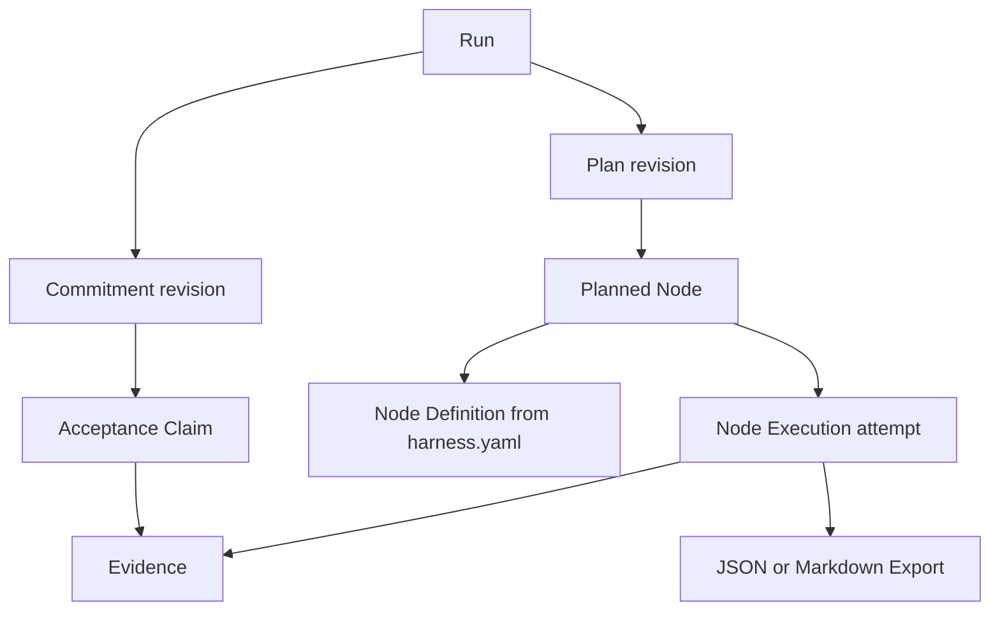

# Harness architecture

## Summary

Harness is not a Workflow engine. It lets an agent explore freely, then adds
durable control only when work needs a Commitment, acceptance Claims, a
task-scoped Plan, delegated execution, recovery, or delivery authority.

The current design decision is recorded in
[`docs/raw/sources/2026-08-21-harness-v2-decision.md`](../raw/sources/2026-08-21-harness-v2-decision.md).
Config version 3 resource semantics are recorded in the
[unified context resource decision](../raw/sources/2026-08-25-context-resource-decision.md).

## Model

The important separations are:

- `harness.yaml` owns the branch/worktree strategy, repository Context,
  reusable Skills, and Node Definitions. Context applies to the Run; Nodes
  reference only Skills.
- A Node ID is its stable reference and default humanized Dashboard label;
  Node Definitions do not duplicate it with a `name` field.
- Every Node has a non-empty usage `description`. It supports capability
  discovery and Dashboard detail display but has no scheduling semantics.
- Node authority is a minimum semantic requirement inherited by Planned Nodes;
  the active Commitment must authorize every item, and a Plan cannot override
  the definition to weaken that boundary.
- Node inputs and outputs are named inline JSON Schema ports. Definitions remain
  independent; Plan dependencies decide composition, while execution start and
  successful finish validate actual values against the frozen Run snapshot.
- Planned Nodes do not repeat expected output names; Dashboard and execution
  validation derive them from the frozen Node Definition output contract.
- `ready_nodes` resolves each ready Planned Node into an execution assignment
  using the frozen Run snapshot. The assignment exposes the exact Agent Skills
  or Command plus description and port contracts without duplicating them into
  Plan state. A shared envelope carries Run ID, logical Workspace and path,
  Commitment revision, and Plan revision so the result can be dispatched
  without reconstructing execution context.
- `execution_start` echoes the assignment's Commitment revision, Plan revision,
  and Planned Node ID. Core and event replay both reject stale revisions before
  a Node Execution can enter the authoritative history.
- A terminal attempt never re-enters `ready_nodes`. `execution_retry` is the
  only retry path for failed, blocked, cancelled, or interrupted attempts and
  requires a reason plus Evidence owned by the preceding attempt. Skipped and
  successful attempts remain terminal.
- Command processes remain host-owned. The host runs the frozen command in the
  assignment workspace path, maps process termination to Node status, keeps raw
  logs as Evidence when useful, and submits any declared structured outputs
  separately for Core validation; Harness does not parse stdout as JSON.
- The resolved Run configuration lives at `cache/config.snapshot.yaml`. It is
  persistent for the Run lifetime, and Plan proposal, execution, and Dashboard
  projection all consume it; later workspace config edits affect only new Runs.
- A resource source contains only a required `entry` and optional `repo`.
  Remote Skills materialize through `npx skills`; remote Context files come
  from the repository's latest default branch. Activation records content
  digest and any resolved Git revision.
- Run-scoped resources are lazy-pinned under `cache/resources/` on first
  activation. Full Skill directories and Context files survive service restart,
  and their digest is verified before reuse; new Runs may resolve newer content.
- Workspace preparation is lazy: after implementation intent is known,
  `workspace_prepare` fetches the base and issues a Receipt for the prepared
  branch or worktree. Public `run_create` rejects missing, stale, or mismatched
  Receipts. Preparation is not a Plan node; read-only questions and
  configuration-only maintenance never trigger it.
- A Commitment owns current intent, scope, authority, destination, acceptance,
  and unresolved decisions.
- A Plan owns the currently executable dependencies for one Run and Commitment
  revision. A later revision may be a minimal patch delta; it does not restart
  unaffected design, implementation, or verification work.
- Open acceptance Claims must be covered by Planned Node `targetClaimIds`.
  Incremental Plans for the same Commitment may reuse coverage from earlier
  revisions. The Dashboard resolves those links to current Claim descriptions,
  statuses, and Evidence counts; execution success never updates a Claim
  automatically.
- A Planned Node may carry one of five display phases for coarse Dashboard
  grouping. Phase has no scheduling or completion semantics; dependencies and
  Claims remain authoritative.
- A Node Execution owns one immutable attempt, including a bounded structured
  input snapshot, optional structured output, Evidence links, and immutable
  JSON/Markdown Exports. Spec is an Export role, not a special Core object.
- Evidence owns a digest identity and locator plus Core-derived Execution,
  Commitment revision, Plan revision, Planned Node, and input-digest bindings.
  A later Plan input change for the same Planned Node makes earlier Evidence
  stale without invalidating unrelated proof.

## Authority and state

Clients call semantic commands. They do not append arbitrary events or allocate
revision, attempt, identity, timestamp, or sequence fields.

`events.jsonl` is the authoritative hash chain. `state.json` is a rebuildable
projection. Run cache snapshots and digest-addressed Evidence are immutable
supporting artifacts. Node Exports are copied into `exports/` in the Run bundle
and verified by digest before Dashboard preview. Resource activation is also recorded in the event chain,
so no mutable resource-lock side file can override replay.

Completed Runs also contain `reports/retrospective.md`. It is generated from the
retrospective and proposal projection for human review and Dashboard preview;
it is rebuildable and never replaces the event chain or JSON data.

A Run is only eligible for `run_complete` after the active Commitment has no
unresolved decision and every acceptance Claim is satisfied or validly waived
with current Evidence, and every running execution has reached a terminal
status. Eligibility does not itself complete the Run; completion is an explicit
semantic command that freezes later execution-domain mutation.

During incremental iteration, the controller classifies work as `reuse`,
`rerun`, or `add`. Only the latter two become nodes in the revised Plan.
Unchanged material boundaries keep the current Commitment; changes to objective,
scope, acceptance, authority, destination, or unresolved material decisions
create a new Commitment revision.

## Conversation continuity

The controller ends each user-facing response with a concrete next action and
its owner, including exploration before a Run exists and intermediate progress.
Clarification questions and confirmation requests end with the question or
request instead. Actionable authorized work continues without requiring another
user prompt. External waits identify the dependency and how it can be unblocked;
completed tasks state that no required work remains and keep optional follow-ups
optional. This convention adds no Core state or scheduling semantics.

## Knowledge maintenance

Harness may attribute evidence-backed feedback to an activated Context
resource and generate a post-completion proposal. It owns the Evidence,
proposal, decision, and validation lineage, not the knowledge content or index.
An accepted proposal becomes a separate maintenance task against the owning
repository or Context Provider.

Necessary knowledge updates may also happen inline with authorized
implementation rather than waiting for Retrospective. Canonical knowledge
describes the current useful system state. Specs and Run Evidence retain design
alternatives and evolution; active knowledge retains an older approach only
when compatibility, migration, rollback, or diagnosis still depends on it.

For repository-owned knowledge, `AGENTS.md` is a concise instruction and routing
layer while `docs/` contains maintained explanations and synthesis. Complex
repositories may repeat that pair at durable module boundaries. The root owns
cross-module knowledge; nested files record local differences without copying
root instructions.

The repository-specific convention is recorded in the
[knowledge maintenance decision](../raw/sources/2026-08-24-repository-knowledge-maintenance-decision.md).

## Capability Runtime

`CapabilityRuntime` is owned by this repository. The Cordis implementation
provides scoped provider registration, progressive activation, idempotency, and
lifecycle cleanup across global, workspace, Run, planned-node, and execution
scopes.

Cordis is intentionally outside Core authority. It cannot revise a Commitment,
activate a Plan, change a Claim, or complete a Run. Its isolation is in-process;
strong isolation uses host-native subagents, sessions, processes, containers,
filesystem sandboxes, or credential boundaries.

## Code map

| Concern | Location |
| --- | --- |
| Domain contracts | `src/core/types.ts` |
| Plan DAG and ready nodes | `src/core/graph.ts` |
| Commitment, Plan, Claim invariants | `src/core/runtime.ts` |
| Event replay projection | `src/core/state/projection.ts` |
| Retrospective Markdown projection | `src/core/retrospective-report.ts` |
| Generic Export snapshot and lookup | `src/core/state/store.ts` |
| Git workspace preparation and Receipt validation | `src/core/workspace.ts` |
| Repository boundary and semantic commands | `src/core/state/store.ts` |
| Cordis capability lifecycle | `src/core/capabilities.ts` |
| Workspace resource provider | `src/core/resources.ts` |
| Public semantic MCP tools | `src/mcp/server.ts` |
| Controller behavior | `skills/harness-work/SKILL.md` |
| Problem framing and Spec lifecycle | `skills/harness-work/references/framing-and-spec.md` |
| Configuration lifecycle | `skills/harness-work/references/configuration.md` |
| Public contract | `docs/harness-core.md` |

## Future seams, not current features

The local implementation reserves logical workspace identity, a
`RunRepository` interface, digest-based Export identity, structured executor
contracts, cancellation, idempotency, and global identifiers. These keep a
future cloud or cross-device executor from forcing a Core rewrite.

There is no current coordinator, remote scheduler, worker lease, agent/device
registry, object store, mailbox, P2P transport, cross-device synchronization,
multi-tenancy, cloud auth, vault, or billing implementation.

## Change checklist

When changing Core:

1. Keep Workflow and fixed Stage absent from executable contracts.
2. Keep Node Definition dependencies out of `harness.yaml`.
3. Add a semantic command instead of exposing raw event mutation.
4. Ensure the event projection rejects the same invalid transition.
5. Test stale revision, idempotency, replay, and completion invariants.
6. Update `docs/harness-core.md`, this Wiki, schemas, and `/harness-work` together.

_Last updated: 2026-08-27 — closed Run terminal, retry, Evidence freshness, and semantic idempotency boundaries._
