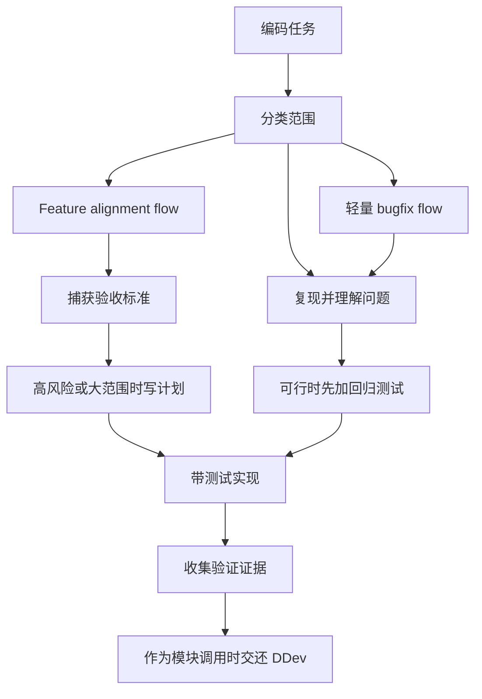

<!-- Generated by scripts/sync-site-content.mjs. Do not edit directly. -->

# spec-driven-coding

> DDev-native coding workflow，用于行为对齐、调试、TDD 和验证。

## 它是做什么的

`spec-driven-coding` 让实现始终和预期行为、验证证据保持一致。它支持轻量的
feature alignment、调试、可行时先写回归测试、TDD，以及编码过程中需求变化的处理。
当 `ddev` 调用它时，它是 coding-flow 模块，会在收集完编码证据后把生命周期控制权交还
给 DDev。



## 什么时候触发

- 开始新功能或行为变更。
- 多步骤实现工作。
- 需求模糊，需要先对齐行为或风险。
- 简单 bugfix 仍需要调试、回归测试和验证。
- 编码过程中发现需求变化。

## 安装

```bash
npx skills add deweyou/agents --skill spec-driven-coding
```

仓库级接入更推荐：

```bash
deweyou-cli agent init --skills spec-driven-coding
```

## 特点

- 将工作分类为 feature alignment、轻量 bugfix、debugging 或非编码 flow。
- 实现前捕获目标、非目标、受影响行为、验收标准、可能文件和验证方式。
- 对大范围或高风险工作使用简洁计划，但不要求外部 workflow backend。
- 简单 bugfix 聚焦复现、回归测试、最小责任边界修复和目标验证。
- 当需求或长期行为变化时，更新任务上下文或 repo memory。
- 被 DDev 作为模块调用时，在编码证据完成后交还 DDev。

## SOP

1. 编辑前先分类任务。
2. 对 feature alignment，在实现前捕获行为边界和验收标准。
3. 对轻量 bugfix，复现问题，并在可行时添加回归测试。
4. 用 TDD 实现；当测试无法覆盖风险时，使用聚焦验证。
5. 将改动限制在已确认需求、假设和验证地图内。
6. 实现过程中需求变化时，更新任务上下文或重新对齐。
7. 运行相关项目检查并收集验证证据。
8. 只有当长期记忆或交付需要时，才运行 `repo-memory` 或 `git-delivery`。

## Source

This skill is maintained in `deweyou/agents` and indexed by
`deweyou-cli agent update`.
