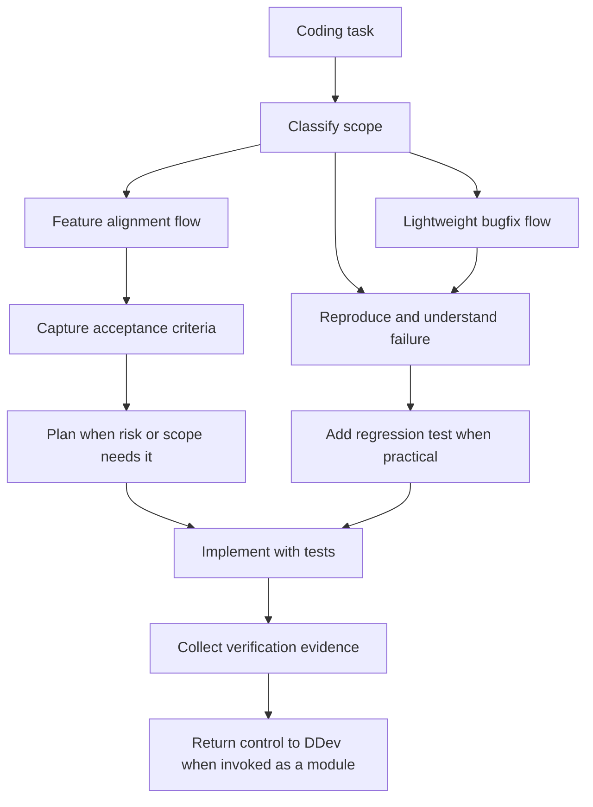

# spec-driven-coding

> DDev-native coding workflow for behavior alignment, debugging, TDD, and verification.

## What it does

`spec-driven-coding` keeps implementation aligned with expected behavior and
verification evidence. It supports thin feature alignment, debugging,
regression-first bug fixes, TDD when practical, and requirement-change handling.
When invoked by `ddev`, it acts as a module and returns lifecycle ownership to
DDev after coding evidence is collected.



## When it triggers

- Starting a new feature or behavior change
- Multi-step implementation work
- Ambiguous requirements that need behavior or risk alignment
- Simple bugfixes that still need debugging, regression tests, and verification
- Requirement changes discovered during coding

## Installation

```bash
npx skills add deweyou/agents --skill spec-driven-coding
```

For repository-wide setup, prefer:

```bash
deweyou-cli agent init --skills spec-driven-coding
```

## Features

- Classifies work into feature alignment, lightweight bugfix, debugging, or no
  coding flow.
- Captures goals, non-goals, affected behavior, acceptance criteria, likely
  files, and verification before implementation.
- Uses concise plans for broad or high-risk work without requiring an external
  workflow backend.
- Keeps simple bugfixes focused on reproduction, regression tests, the smallest
  responsible fix, and targeted verification.
- Updates task context or repo memory when requirements or durable behavior
  change.
- Returns control to DDev after coding evidence when invoked as a DDev module.

## SOP

1. Classify the task before editing.
2. For feature alignment, capture the behavior boundary and acceptance criteria
   before implementation.
3. For lightweight bugfixes, reproduce the issue and add a regression test when
   practical.
4. Implement with TDD or focused verification where tests cannot cover the risk.
5. Keep edits scoped to the accepted requirement, assumptions, and verification
   map.
6. Update task context or ask for alignment when requirements change during
   implementation.
7. Run relevant project checks and capture verification evidence.
8. Run `repo-memory` or `git-delivery` only when durable memory or delivery is
   needed.

## Source

This skill is maintained in `deweyou/agents` and indexed by
`deweyou-cli agent update`.
